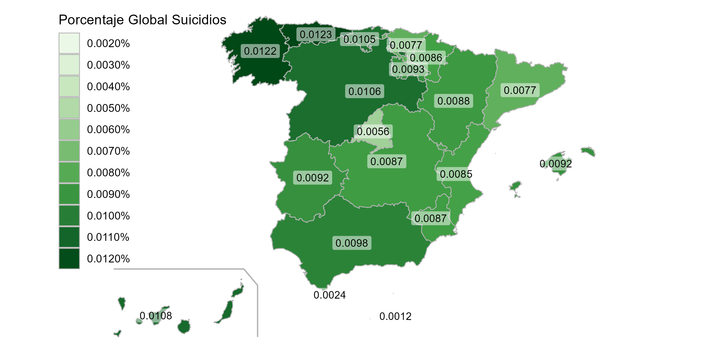

```{r setup, include=FALSE}
knitr::opts_chunk$set(echo = TRUE)
```

[REPOSITORIO EN GITHUB](https://github.com/amf1014/VAC_fuentes-de-datos.git)

# Tabla de contenidos
1. Introducción
2. Objetivos
3. Paquetes utilizados
4. Desarrollo
5. Conclusiones finales


## 1. INTRODUCCIÓN
En España se estima que la tasa de suicidio es aproximadamente de un 13,9 por 100.000 hab/ año. Un número preocupante, pero ¿que motivos pueden llevar a dicha tragedia? 
En este seminario vamos a tratar de encontrar relación entre el suicidio, el ejercicio físico y el consumo de alcohol.


## 2. OBJETIVOS
En un primer lugar, vamos a observar y a intentar obtener información de cada conjunto de datos por separado. 

Sobre el conjunto de datos sobre el suicidio, observamos las diferencias que hay en el número de suicidios según:

- Sexo.

- Comunidades autónomas.

Sobre el conjunto de datos sobre el consumo de alcohol, observamos las diferencias que hay en el número de consumo de alcohol según:

- Sexo.

- Comunidad autónoma.

Sobre el conjunto de datos sobre el ejercicio físico, observamos las diferencias que hay en el número de ejercicio físico que se realiza según:

- Sexo.

- Comunidades autónomas.

- Realización de ejercicio o no.

Una vez analizado por separado cada conjunto de datos, pasamos a observar si hay relación entre ellos, centrándonos especialmente en:

1.- Relación entre el suicidio y el consumo de alcohol por comunidad autónoma y por sexo.

2.- Relación entre el suicidio y el ejercicio físico por comunidad autónoma y por sexo.

3.- Relación entre el ejercicio físico y el consumo de alcohol por comunidad autónoma y por sexo.

## 3. Paquetes utilizados
A lo largo del seminario utilizamos varios paquetes:

1. El paquete "dplyr" para manipulación de datos, filtra, ordena, agrupa y resume datos:
```{r, eval = TRUE, message = FALSE, warning = FALSE}
#install.packages("dplyr") así es como lo hemos instalado.
library(dplyr)
```

2. El paquete "tidyverse" para análisis de datos, importa, limpia, transforma, visualiza y modela datos:
```{r, eval = TRUE, message = FALSE, warning = FALSE}
#install.packages("tidyverse") así es como lo hemos instalado.
library(tidyverse)
```

3. El paquere "rjson" para leer y escribir datos en formato JSON:
```{r, eval = TRUE, message = FALSE, warning = FALSE}
#install.packages("rjson") así es como lo hemos instalado.
library(rjson)
```

4. El paquete "tidyjson" para manipular datos JSON en formatp tidy:
```{r, eval = TRUE, message = FALSE, warning = FALSE}
#install.packages("tidyjson") así es como lo hemos instalado.
library(tidyjson)
```

5. El paquete "ggplot2" para visualizar datos, en formato de gráfico.
```{r, eval = TRUE, message = FALSE, warning = FALSE}
#install.packages("ggplot2") así es como lo hemos instalado.
library(ggplot2)
```

6. El paquete "mapSpain" para visualizar un gráfico con mapa específico de España:
```{r, eval = TRUE, message = FALSE, warning = FALSE}
#install.packages("mapSpain") así es como lo hemos instalado.
library(mapSpain)
```

7. El paquete "sf" para manejar datos espaciales:
```{r, eval = TRUE, message = FALSE, warning = FALSE}
#install.packages("sf") así es como lo hemos instalado.
library(sf)
```

8. El paquete "patchwork" para combinar varios gráficos en una sola salida:
```{r, eval = TRUE, message = FALSE, warning = FALSE}
#install.packages("patchwork") así es como lo hemos instalado.
library(patchwork)
```

9. El paquete "DT" para crear tablas interactivas:
```{r, eval = TRUE, message = FALSE, warning = FALSE}
#install.packages("DT") así es como lo hemos instalado.
library(DT)
```

10. El paquete "plotly" para visualización interactiva de gráficos:
```{r, eval = TRUE, message = FALSE, warning = FALSE}
#install.packages("plotly") así es como lo hemos instalado.
library(plotly)
```

## 4. Desarrollo

### Carga de datos a usar.
Vamos a trabajar con tres conjuntos de datos en formato json, por tanto cargamos cada uno de ellos.
```{r}


suicidio <- fromJSON(file = "INPUT/DATA/Suicidios_por_comunidades.json")
consumo_alcohol <- fromJSON(file = "INPUT/DATA/consumo_de_alcohol.json")
ejercicioFisico <- fromJSON(file = "INPUT/DATA/Ejercicio_fisico.json")
```

### Formateo de datos
Una vez cargados, procedemos a formatear los datos para crear tablas ordenadas con los datos que nos interesan.

#### Formateo de datos del conjunto de datos de suicidio:

```{r, eval = TRUE}

suicidio %>%
  gather_object %>%
  json_types %>%
  count(name,type)


suicidio1 <- suicidio %>%
  enter_object(Data) %>%
  gather_array %>%
  spread_all %>%
  select("document.id", "Valor")


suicidio2 <- suicidio %>%
  enter_object(MetaData) %>%
  gather_array %>%
  spread_all %>%
  select("document.id", "Nombre")
  

suicidio3 <- suicidio1 %>%
  select(c("document.id","Valor")) %>%
  full_join(x = .,
            y = suicidio2 %>%
              select(c("document.id","Nombre")),
            by = c("document.id"))

suicidio4 <- suicidio3 %>%
  mutate(
    sexo = case_when(
      Nombre == "Ambos sexos" ~ "Ambos sexos",
      Nombre == "Hombres" ~ "Hombres",
      Nombre == "Mujeres" ~ "Mujeres",
      TRUE ~ as.character(NA)
    )
  )

suicidio5 <- suicidio4 %>%
  mutate(
    años = case_when(
      Nombre == "Todas las edades" ~ "Todas las edades",
      Nombre == "Menores de 15 años" ~ "Menores de 15 años",
      Nombre == "De 15 a 29 años" ~ "De 15 a 29 años",
      Nombre == "De 30 a 39 años" ~ "De 30 a 39 años",
      Nombre == "De 40 a 44 años" ~ "De 40 a 44 años",
      Nombre == "De 45 a 49 años" ~ "De 45 a 49 años",
      Nombre == "De 50 a 54 años" ~ "De 50 a 54 años",
      Nombre == "De 55 a 59 años" ~ "De 55 a 59 años",
      Nombre == "De 60 a 64 años" ~ "De 60 a 64 años",
      Nombre == "De 65 a 69 años" ~ "De 65 a 69 años",
      Nombre == "De 70 a 74 años" ~ "De 70 a 74 años",
      Nombre == "De 75 a 79 años" ~ "De 75 a 79 años",
      Nombre == "De 80 a 84 años" ~ "De 80 a 84 años",
      Nombre == "De 85 a 89 años" ~ "De 85 a 89 años",
      Nombre == "De 90 a 94 años" ~ "De 90 a 94 años",
      Nombre == "De 95 años y más" ~ "De 95 años y más",
      TRUE ~ as.character(NA)
    )
  )

suicidio6 <- suicidio5 %>%
  mutate(
    comunidades_autonomas = case_when(
      Nombre == "Total" ~ "Total nacional",
      Nombre == "Andalucía" ~ "Andalucía",
      Nombre == "Aragón" ~ "Aragón",
      Nombre == "Asturias, Principado de" ~ "Principado de Asturias",
      Nombre == "Balears, Illes" ~ "Islas Baleares",
      Nombre == "Canarias" ~ "Islas Canarias",
      Nombre == "Cantabria" ~ "Cantabria",
      Nombre == "Castilla y León" ~ "Castilla y León",
      Nombre == "Castilla-La Mancha" ~ "Castilla-La Mancha",
      Nombre == "Cataluña" ~ "Cataluña",
      Nombre == "Comunitat Valenciana" ~ "Comunitat Valenciana",
      Nombre == "Extremadura" ~ "Extremadura",
      Nombre == "Galicia" ~ "Galicia",
      Nombre == "Madrid, Comunidad de" ~ "Madrid",
      Nombre == "Murcia, Región de" ~ "Murcia",
      Nombre == "Navarra, Comunidad Foral de" ~ "Navarra",
      Nombre == "País Vasco" ~ "País Vasco",
      Nombre == "Rioja, La" ~ "La Rioja",
      Nombre == "Ceuta" ~ "Ceuta",
      Nombre == "Melilla" ~ "Melilla",
      TRUE ~ as.character(NA)
    )
  )

suicidio7 <- 
  as.data.frame(apply(suicidio6, 2, function(col) col[!is.na(col)])) 

suicidio7 <- suicidio7[, -3]

suicidio7$Valor <- suicidio7$Valor[seq(1, length(suicidio7$Valor), by = 3)]

suicidio7$Valor <- suicidio7$Valor[seq(1, length(suicidio7$Valor), by = 16)]

suicidio7$sexo <- suicidio7$sexo[seq(1, length(suicidio7$sexo), by = 16)]

suicidio7$comunidades_autonomas <- suicidio7$comunidades_autonomas[seq(1, length(suicidio7$comunidades_autonomas), by = 16)]


suicidio8 <- suicidio7%>%
  select(-años)


suicidio9 <- suicidio8 %>%
  mutate(
    habitantes = case_when(
      comunidades_autonomas == "Total nacional" & sexo == "Ambos sexos" ~ 48592802,
      comunidades_autonomas == "Total nacional" & sexo == "Hombres" ~ 23807546,
      comunidades_autonomas == "Total nacional" & sexo == "Mujeres" ~ 24785363,
      comunidades_autonomas == "Andalucía" & sexo == "Ambos sexos" ~ 8620120,
      comunidades_autonomas == "Andalucía" & sexo == "Hombres" ~ 4238717,
      comunidades_autonomas == "Andalucía" & sexo == "Mujeres" ~ 4381403,
      comunidades_autonomas == "Aragón" & sexo == "Ambos sexos" ~ 1348918,
      comunidades_autonomas == "Aragón" & sexo == "Hombres" ~ 666949,
      comunidades_autonomas == "Aragón" & sexo == "Mujeres" ~ 681969,
      comunidades_autonomas == "Principado de Asturias" & sexo == "Ambos sexos" ~ 1008876,
      comunidades_autonomas == "Principado de Asturias" & sexo == "Hombres" ~ 481018,
      comunidades_autonomas == "Principado de Asturias" & sexo == "Mujeres" ~ 527858,
      comunidades_autonomas == "Islas Baleares" & sexo == "Ambos sexos" ~ 1231487,
      comunidades_autonomas == "Islas Baleares" & sexo == "Hombres" ~ 614011,
      comunidades_autonomas == "Islas Baleares" & sexo == "Mujeres" ~ 617476,
      comunidades_autonomas == "Islas Canarias" & sexo == "Ambos sexos" ~ 2236013,
      comunidades_autonomas == "Islas Canarias" & sexo == "Hombres" ~ 1103805,
      comunidades_autonomas == "Islas Canarias" & sexo == "Mujeres" ~ 1132208,
      comunidades_autonomas == "Cantabria" & sexo == "Ambos sexos" ~ 591151,
      comunidades_autonomas == "Cantabria" & sexo == "Hombres" ~ 286341,
      comunidades_autonomas == "Cantabria" & sexo == "Mujeres" ~ 304810,
      comunidades_autonomas == "Castilla y León" & sexo == "Ambos sexos" ~ 2389959,
      comunidades_autonomas == "Castilla y León" & sexo == "Hombres" ~ 1175016,
      comunidades_autonomas == "Castilla y León" & sexo == "Mujeres" ~ 1214943,
      comunidades_autonomas == "Castilla-La Mancha" & sexo == "Ambos sexos" ~ 2100523,
      comunidades_autonomas == "Castilla-La Mancha" & sexo == "Hombres" ~ 1053361,
      comunidades_autonomas == "Castilla-La Mancha" & sexo == "Mujeres" ~ 1047162,
      comunidades_autonomas == "Cataluña" & sexo == "Ambos sexos" ~ 8021049,
      comunidades_autonomas == "Cataluña" & sexo == "Hombres" ~ 3948555,
      comunidades_autonomas == "Cataluña" & sexo == "Mujeres" ~ 4072494,
      comunidades_autonomas == "Comunidad Valenciana" & sexo == "Ambos sexos" ~ 5316478,
      comunidades_autonomas == "Comunidad Valenciana" & sexo == "Hombres" ~ 2613918,
      comunidades_autonomas == "Comunidad Valenciana" & sexo == "Mujeres" ~ 2702560,
      comunidades_autonomas == "Extremadura" & sexo == "Ambos sexos" ~ 1053423,
      comunidades_autonomas == "Extremadura" & sexo == "Hombres" ~ 521005,
      comunidades_autonomas == "Extremadura" & sexo == "Mujeres" ~ 532418,
      comunidades_autonomas == "Galicia" & sexo == "Ambos sexos" ~ 2705877,
      comunidades_autonomas == "Galicia" & sexo == "Hombres" ~ 1301669,
      comunidades_autonomas == "Galicia" & sexo == "Mujeres" ~ 1404208,
      comunidades_autonomas == "Madrid" & sexo == "Ambos sexos" ~ 7000621,
      comunidades_autonomas == "Madrid" & sexo == "Hombres" ~ 3352591,
      comunidades_autonomas == "Madrid" & sexo == "Mujeres" ~ 3648030,
      comunidades_autonomas == "Murcia" & sexo == "Ambos sexos" ~ 1569164,
      comunidades_autonomas == "Murcia" & sexo == "Hombres" ~ 786213,
      comunidades_autonomas == "Murcia" & sexo == "Mujeres" ~ 782951,
      comunidades_autonomas == "Navarra" & sexo == "Ambos sexos" ~ 678103,
      comunidades_autonomas == "Navarra" & sexo == "Hombres" ~ 335742,
      comunidades_autonomas == "Navarra" & sexo == "Mujeres" ~ 342361,
      comunidades_autonomas == "País Vasco" & sexo == "Ambos sexos" ~ 2227581,
      comunidades_autonomas == "País Vasco" & sexo == "Hombres" ~ 1083234,
      comunidades_autonomas == "País Vasco" & sexo == "Mujeres" ~ 1144347,
      comunidades_autonomas == "La Rioja" & sexo == "Ambos sexos" ~ 324226,
      comunidades_autonomas == "La Rioja" & sexo == "Hombres" ~160074,
      comunidades_autonomas == "La Rioja" & sexo == "Mujeres" ~ 164152,
      comunidades_autonomas == "Ceuta" & sexo == "Ambos sexos" ~ 83284,
      comunidades_autonomas == "Ceuta" & sexo == "Hombres" ~ 41990,
      comunidades_autonomas == "Ceuta" & sexo == "Mujeres" ~ 41294,
      comunidades_autonomas == "Melilla" & sexo == "Ambos sexos" ~ 86056,
      comunidades_autonomas == "Melilla" & sexo == "Hombres" ~ 43337,
      comunidades_autonomas == "Melilla" & sexo == "Mujeres" ~ 42719,
      TRUE ~ as.numeric(NA)
    )
  )


suicidio10 <- suicidio9 %>%
  mutate(
    porcentaje_suicidios = (as.numeric(Valor) / habitantes) * 100 
  )

suicidio10 <- suicidio10 %>% slice(1:60)

datatable(suicidio10, options = list(pageLength = 10))
```

También vamos a añadir el código necesario, para la creación de lo mapas de España:
```{r, eval = TRUE}
census <- mapSpain::pobmun19

codelist <- mapSpain::esp_codelist %>%
  select(cpro, codauto) %>%
  distinct()

census_ccaa <- census %>%
  left_join(codelist) %>%
  group_by(codauto) %>%
  summarise(pob19 = sum(pob19), men = sum(men), women = sum(women)) %>%
  mutate(
    porc_women = women / pob19,
    porc_women_lab = paste0(round(100 * porc_women, 2), "%")
  )
ccaa_sf <- esp_get_ccaa() %>%
  left_join(census_ccaa)
can <- esp_get_can_box()


suicidio10 <- suicidio10 %>%
  mutate(comunidades_autonomas = case_when(
    comunidades_autonomas == "Islas Baleares" ~ "Balears, Illes",
    comunidades_autonomas == "Islas Canarias" ~ "Canarias",
    comunidades_autonomas == "Castilla-La Mancha" ~ "Castilla - La Mancha",
    comunidades_autonomas == "Principado de Asturias" ~ "Asturias, Principado de",
    comunidades_autonomas == "Comunidad Valenciana" ~ "Comunitat Valenciana",
    comunidades_autonomas == "Madrid" ~ "Madrid, Comunidad de",
    comunidades_autonomas == "Murcia" ~ "Murcia, Región de",
    comunidades_autonomas == "Navarra" ~ "Navarra, Comunidad Foral de",
    comunidades_autonomas == "La Rioja" ~ "Rioja, La",
    TRUE ~ comunidades_autonomas
  ))

suicidio_global <- suicidio10 %>%
  filter(sexo == "Ambos sexos") %>%
  group_by(comunidades_autonomas)%>%
  summarize(porcentaje_global_suicidios = mean(porcentaje_suicidios, na.rm = TRUE))

suicidio_mujeres <- suicidio10 %>%
  filter(sexo == "Mujeres") %>%
  group_by(comunidades_autonomas) %>%
  summarize(
    porcentaje_mujeres_suicidios = mean(porcentaje_suicidios, na.rm = TRUE)
    )

suicidio_hombres <- suicidio10 %>%
  filter(sexo == "Hombres") %>%
  group_by(comunidades_autonomas)%>%
  summarize(porcentaje_hombres_suicidios = mean(porcentaje_suicidios, na.rm = TRUE))

levels(factor(ccaa_sf$ine.ccaa.name))
levels(factor(suicidio_mujeres$comunidades_autonomas))

ccaa_sf <- esp_get_ccaa() %>%
  left_join(suicidio_mujeres, by = c("ine.ccaa.name" = "comunidades_autonomas"))

ccaa_sm <- esp_get_ccaa() %>%
  left_join(suicidio_hombres, by = c("ine.ccaa.name" = "comunidades_autonomas"))

ccaa_sg <- esp_get_ccaa() %>%
  left_join(suicidio_global, by = c("ine.ccaa.name" = "comunidades_autonomas"))
```

#### Formateo de datos del conjunto de datos del consumo de alcohol:

```{r, eval = TRUE}

consumo_alcohol_tiposresum<-consumo_alcohol %>%  
  gather_object %>% 
  json_types %>% 
  count(name, type)
consumo_alcohol_tiposresum

#consumo_alcohol_tiposresum$name[3]

consumo_alcohol1<-consumo_alcohol %>%
  enter_object(Data) %>%
  gather_array %>%
  spread_all %>%
  select("document.id", "Valor")

consumo_alcohol1

consumo_alcohol2<-consumo_alcohol %>%
  enter_object(MetaData) %>%
  gather_array %>%
  spread_all %>%
  select("document.id", "Nombre")
  
consumo_alcohol2

consumo_alcohol3 <- consumo_alcohol1 %>%
  select(c("document.id","Valor")) %>%
  full_join(x = .,
            y = consumo_alcohol2 %>%
              select(c("document.id","Nombre")),
            by = c("document.id"))

consumo_alcohol4 <- consumo_alcohol3 %>%
  mutate(
    Sexo = case_when(
      Nombre == "Ambos sexos" ~ "Ambos sexos",
      Nombre == "Hombres" ~ "Hombres",
      Nombre == "Mujeres" ~ "Mujeres",
      TRUE ~ as.character(NA)
    )
  )

consumo_alcohol5 <- consumo_alcohol4 %>%
  mutate(
    Comunidades_autonomas = case_when(
      Nombre == "Total" ~ "Total Nacional",
      Nombre == "Andalucía" ~ "Andalucía",
      Nombre == "Aragón" ~ "Aragón",
      Nombre == "Asturias (Principado de)" ~ "Principado de Asturias",
      Nombre == "Balears (Illes)" ~ "Islas Baleares",
      Nombre == "Canarias" ~ "Islas Canarias",
      Nombre == "Cantabria" ~ "Cantabria",
      Nombre == "Castilla y León" ~ "Castilla y León",
      Nombre == "Castilla-La Mancha" ~ "Castilla-La Mancha",
      Nombre == "Cataluña" ~ "Cataluña",
      Nombre == "Comunitat Valenciana" ~ "Comunitat Valenciana",
      Nombre == "Extremadura" ~ "Extremadura",
      Nombre == "Galicia" ~ "Galicia",
      Nombre == "Madrid (Comunidad de)" ~ "Madrid",
      Nombre == "Murcia (Región de)" ~ "Murcia",
      Nombre == "Navarra (Comunidad Foral de)" ~ "Navarra",
      Nombre == "País Vasco" ~ "País Vasco",
      Nombre == "Rioja (La)" ~ "La Rioja",
      Nombre == "Ceuta (Ciudad Autónoma de)" ~ "Ceuta",
      Nombre == "Melilla (Ciudad Autónoma de)" ~ "Melilla",
      TRUE ~ as.character(NA)
    )
  )

consumo_alcohol6 <- consumo_alcohol5 %>%
  mutate(
    Consumido = case_when(
      Nombre == "TOTAL" ~ "Total_personas_encuestadas",
      Nombre == "Sí ha consumido" ~ "Si_ha_consumido",
      Nombre == "No ha consumido" ~ "No_ha_consumido",
      Nombre == "No consta" ~ "No_consta",
      TRUE ~ as.character(NA)
    )
  )

consumo_alcohol7 <- 
  as.data.frame(apply(consumo_alcohol6, 2, function(col) col[!is.na(col)])) 

consumo_alcohol7$Valor <- consumo_alcohol7$Valor[seq(1, length(consumo_alcohol7$Valor), by = 3 )]

consumo_alcohol8<-consumo_alcohol7%>%
  pivot_wider(names_from = Consumido, values_from = Valor)

consumo_alcohol8 <- 
  as.data.frame(apply(consumo_alcohol8, 2, function(col) col[!is.na(col)])) 

consumo_alcohol8 <-consumo_alcohol8%>%
  mutate(
    `Si_ha_consumido` = as.numeric(`Si_ha_consumido`),
    `Total_personas_encuestadas` = as.numeric(`Total_personas_encuestadas`),
    `No_ha_consumido` = as.numeric(`No_ha_consumido`)
  )

consumo_alcohol9 <- consumo_alcohol8 %>%
  mutate(
    Porcentaje_consumo = (`Si_ha_consumido`/`Total_personas_encuestadas`)*100
  )

consumo_alcohol10 <- consumo_alcohol9 %>%
  mutate(
    Porcentaje_no_consumo = (`No_ha_consumido`/`Total_personas_encuestadas`)*100
  )

consumo_alcohol10 <- consumo_alcohol10[, -2]

consumo_alcohol10$Comunidades_autonomas <- consumo_alcohol10$Comunidades_autonomas[seq(1, length(consumo_alcohol10$Comunidades_autonomas), by =  4)]
consumo_alcohol10$Sexo <- consumo_alcohol10$Sexo[seq(1, length(consumo_alcohol10$Sexo), by =  4)]

datatable(consumo_alcohol10,options = list(pageLength = 10))
```

En este caso, añadimos también el código necesario para la creación de los mapas de España:

```{r, echo = FALSE}
census_2 <- mapSpain::pobmun19

codelist_2 <- mapSpain::esp_codelist %>%
  select(cpro, codauto) %>%
  distinct()

census_ccaa_2 <- census_2 %>%
  left_join(codelist_2) %>%
  group_by(codauto) %>%
  summarise(pob19 = sum(pob19), men = sum(men), women = sum(women)) %>%
  mutate(
    porc_women = women / pob19,
    porc_women_lab = paste0(round(100 * porc_women, 2), "%")
  )
ccaa_sf_2 <- esp_get_ccaa() %>%
  left_join(census_ccaa_2)
can_2 <- esp_get_can_box()

consumo_alcohol10 <- consumo_alcohol10 %>%
  mutate(Comunidades_autonomas = case_when(
    Comunidades_autonomas == "Islas Baleares" ~ "Balears, Illes",
    Comunidades_autonomas == "Islas Canarias" ~ "Canarias",
    Comunidades_autonomas == "Castilla-La Mancha" ~ "Castilla - La Mancha",
    Comunidades_autonomas == "Principado de Asturias" ~ "Asturias, Principado de",
    Comunidades_autonomas == "Comunidad Valenciana" ~ "Comunitat Valenciana",
    Comunidades_autonomas == "Madrid" ~ "Madrid, Comunidad de",
    Comunidades_autonomas == "Murcia" ~ "Murcia, Región de",
    Comunidades_autonomas == "Navarra" ~ "Navarra, Comunidad Foral de",
    Comunidades_autonomas == "La Rioja" ~ "Rioja, La",
    Comunidades_autonomas == "Total Nacional" ~ "Total nacional",
    TRUE ~ Comunidades_autonomas
  ))

consumo_global <- consumo_alcohol10 %>%
  filter(Sexo == "Ambos sexos") %>%
  group_by(Comunidades_autonomas)%>%
  summarize(Porcentaje_global_consumo = mean(Porcentaje_consumo, na.rm = TRUE))

consumo_mujeres <- consumo_alcohol10 %>%
  filter(Sexo == "Mujeres") %>%
  group_by(Comunidades_autonomas) %>%
  summarize(Porcentaje_mujeres_consumo = mean(Porcentaje_consumo, na.rm = TRUE))

consumo_hombres <- consumo_alcohol10 %>%
  filter(Sexo == "Hombres") %>%
  group_by(Comunidades_autonomas)%>%
  summarize(Porcentaje_hombres_consumo = mean(Porcentaje_consumo, na.rm = TRUE))

no_consumo_global <- consumo_alcohol10 %>%
  filter(Sexo == "Ambos sexos") %>%
  group_by(Comunidades_autonomas)%>%
  summarize(Porcentaje_global_no_consumo = mean(Porcentaje_no_consumo, na.rm = TRUE))

no_consumo_mujeres <- consumo_alcohol10 %>%
  filter(Sexo == "Mujeres") %>%
  group_by(Comunidades_autonomas) %>%
  summarize(Porcentaje_mujeres_no_consumo = mean(Porcentaje_no_consumo, na.rm = TRUE))
 
no_consumo_hombres <- consumo_alcohol10 %>%
  filter(Sexo == "Hombres") %>%
  group_by(Comunidades_autonomas)%>%
  summarize(Porcentaje_hombres_no_consumo = mean(Porcentaje_no_consumo, na.rm = TRUE))

levels(factor(ccaa_sf_2$ine.ccaa.name))
levels(factor(consumo_mujeres$Comunidades_autonomas))

ccaa_sf_2 <- esp_get_ccaa() %>%
  left_join(consumo_mujeres, by = c("ine.ccaa.name" = "Comunidades_autonomas"))

ccaa_sm_2 <- esp_get_ccaa() %>%
  left_join(consumo_hombres, by = c("ine.ccaa.name" = "Comunidades_autonomas"))

ccaa_sg_2 <- esp_get_ccaa() %>%
  left_join(consumo_global, by = c("ine.ccaa.name" = "Comunidades_autonomas"))

```


#### Formateo de datos del conjunto de datos de ejercicio físico:

```{r, eval = TRUE}

tiposEjercicioFisico_visiongeneral<-ejercicioFisico%>% 
  gather_object %>% 
  json_types

tiposEjercicioFisico_visiongeneral

tiposEjercicioFisico <- ejercicioFisico %>%
  gather_object %>% 
  json_types %>% 
  count(name, type)

tiposEjercicioFisico

nombresEjercicioFisico <- ejercicioFisico %>%
  enter_object(Nombre)

#Con la línea siguiente busco interpretar como se guardan los datos.
nombresEjercicioFisico

#Estructurar los datos
ejercicioFisicoData <- ejercicioFisico %>%
  enter_object(Data) %>%
  gather_array %>%
  spread_all%>%
  select(-array.index)

ejercicioFisicoMetaData <-ejercicioFisico %>%
  enter_object(MetaData) %>%
  gather_array %>%
  spread_all %>%
  select(document.id, Nombre)

ejercicioFisicoData
ejercicioFisicoMetaData

ejercicioFisicoUnion <- left_join(ejercicioFisicoMetaData, ejercicioFisicoData, by="document.id")
ejercicioFisicoUnion

ejercicioFisicoUnion <- ejercicioFisicoUnion %>%
  mutate(
    Sexo = case_when(
      Nombre == "Ambos sexos" ~ "Ambos sexos",
      Nombre == "Hombres" ~ "Hombres",
      Nombre == "Mujeres" ~ "Mujeres",
      TRUE ~ as.character(NA)
    ),
    `Comunidades autonomas` = case_when(
      Nombre == "Total" ~ "Total Nacional",
      Nombre == "Andalucía" ~ "Andalucía",
      Nombre == "Aragón" ~ "Aragón",
      Nombre == "Asturias (Principado de)" ~ "Principado de Asturias",
      Nombre == "Balears (Illes)" ~ "Islas Baleares",
      Nombre == "Canarias" ~ "Islas Canarias",
      Nombre == "Cantabria" ~ "Cantabria",
      Nombre == "Castilla y León" ~ "Castilla y León",
      Nombre == "Castilla-La Mancha" ~ "Castilla-La Mancha",
      Nombre == "Cataluña" ~ "Cataluña",
      Nombre == "Comunitat Valenciana" ~ "Comunitat Valenciana",
      Nombre == "Extremadura" ~ "Extremadura",
      Nombre == "Galicia" ~ "Galicia",
      Nombre == "Madrid (Comunidad de)" ~ "Madrid",
      Nombre == "Murcia (Región de)" ~ "Murcia",
      Nombre == "Navarra (Comunidad Foral de)" ~ "Navarra",
      Nombre == "País Vasco" ~ "País Vasco",
      Nombre == "Rioja (La)" ~ "La Rioja",
      Nombre == "Ceuta (Ciudad Autónoma de)" ~ "Ceuta",
      Nombre == "Melilla (Ciudad Autónoma de)" ~ "Melilla",
      TRUE ~ as.character(NA)
    ),
    `Frecuencia de ejercicio` = case_when(
      Nombre == "TOTAL" ~ "TOTAL",
      Nombre == "Ninguno" ~ "Ninguno",
      Nombre == "1 o 2 días a la semana" ~ "1 o 2 días a la semana",
      Nombre == "3 o 4 días a la semana" ~ "3 o 4 días a la semana",
      Nombre == "5 o 6 días a la semana" ~ "5 o 6 días a la semana",
      Nombre == "7 días a la semana" ~ "7 días a la semana",
      TRUE ~ as.character(NA)
    )
  )

ejercicioFisicoUnion

ejercicioFisicoUnion <- ejercicioFisicoUnion %>%
  fill(Sexo, `Comunidades autonomas`, `Frecuencia de ejercicio`, .direction = "up")

ejercicioFisicoUnion

ejercicioFisicoUnion <- filter(ejercicioFisicoUnion, ejercicioFisicoUnion$Nombre == ejercicioFisicoUnion$Sexo)
  
ejercicioFisicoUnion

ejercicioFisicoUnion <- ejercicioFisicoUnion %>%
  select(-Nombre,-document.id)%>%
  rename("Miles de personas"=Valor)

ejercicioFisicoUnion

totalPersonasComunidad <- ejercicioFisicoUnion %>%
  filter(`Frecuencia de ejercicio` == "TOTAL") %>%
  select(`Comunidades autonomas`, `Total personas según la comunidad` = `Miles de personas`)

totalPersonasComunidad
duplicated(totalPersonasComunidad)

totalPersonasComunidad <- totalPersonasComunidad %>%
  distinct(`Comunidades autonomas`, .keep_all = TRUE)

duplicated(totalPersonasComunidad)

ejercicioFisicoUnion <- left_join(ejercicioFisicoUnion, totalPersonasComunidad, by="Comunidades autonomas")
```

### Formateo de datos para relacionar suicidio y consumo de alcohol.

```{r, eval = TRUE}
suicidio_global_mujeres <- suicidio_global %>%
  left_join(suicidio_mujeres, by = "comunidades_autonomas")

suicidio_final <- suicidio_global_mujeres %>%
  left_join(suicidio_hombres, by = "comunidades_autonomas")

suicidio_alcohol <- suicidio_final %>%
  left_join(consumo_global, by = c("comunidades_autonomas" = "Comunidades_autonomas"))

suicidio_alcohol2 <- suicidio_alcohol %>%
  left_join(consumo_mujeres, by = c("comunidades_autonomas" = "Comunidades_autonomas"))

suicidio_alcohol3 <- suicidio_alcohol2 %>%
  left_join(consumo_hombres, by = c("comunidades_autonomas" = "Comunidades_autonomas"))

suicidio_alcohol4 <- suicidio_alcohol3 %>%
  left_join(no_consumo_global, by = c("comunidades_autonomas" = "Comunidades_autonomas"))

suicidio_alcohol5 <- suicidio_alcohol4 %>%
  left_join(no_consumo_mujeres, by = c("comunidades_autonomas" = "Comunidades_autonomas"))

suicidio_alcohol_final <- suicidio_alcohol5 %>%
  left_join(no_consumo_hombres, by = c("comunidades_autonomas" = "Comunidades_autonomas"))


suicidio_alcohol_final_2 <- suicidio_alcohol_final %>%
  pivot_longer(cols = c(porcentaje_global_suicidios, Porcentaje_global_consumo),
               names_to = "tipo_de_porcentaje",
               values_to = "porcentaje")

suicidio_alcohol_final_3 <- suicidio_alcohol_final %>%
  pivot_longer(cols = c(porcentaje_mujeres_suicidios, Porcentaje_mujeres_consumo),
               names_to = "tipo_de_porcentaje",
               values_to = "porcentaje")

suicidio_alcohol_final_4 <- suicidio_alcohol_final %>%
  pivot_longer(cols = c(porcentaje_hombres_suicidios, Porcentaje_hombres_consumo),
               names_to = "tipo_de_porcentaje",
               values_to = "porcentaje")
```


### Análisis de datos

Una vez formateados los datos, pasamos a analizarlos:

#### Para el conjunto de datos de suicidio:

Vamos a agrupar por comunidad autónoma y por sexo.

```{r, eval = TRUE}
suicidio_por_sexo <- suicidio7 %>%
  group_by(sexo) %>%
  summarize(suicidio_medio_sexo=mean(as.numeric(Valor), na.rm = TRUE))


suicidio_por_comunidad <- suicidio7 %>%
  group_by(comunidades_autonomas) %>%
  summarize(suicidio_medio_comunidad=mean(as.numeric(Valor), na.rm = TRUE))


suicidio_por_sexo_comunidad <- suicidio7 %>%
  group_by(sexo, comunidades_autonomas) %>%
  summarize(suicidio_medio_sexo_comunidad=mean(as.numeric(Valor), na.rm = TRUE))

```


#### Para el conjunto de datos de consumo de alcohol:
```{r, eval = TRUE}
consumo_por_sexo <- consumo_alcohol10 %>%
  group_by(Sexo) %>%
  summarize(consumo_medio_sexo = mean(Porcentaje_consumo, na.rm = TRUE)) 

consumo_por_comunidad <- consumo_alcohol10 %>%
  group_by(Comunidades_autonomas) %>%
  summarize(consumo_medio_comunidad = mean(Porcentaje_consumo, na.rm = TRUE))

consumo_por_sexo_comunidad <- consumo_alcohol10 %>%
  group_by(Sexo, Comunidades_autonomas) %>%
  summarize(consumo_medio_sexo_comunidad = mean(Porcentaje_consumo, na.rm = TRUE))
```

#### Para el conjunto de datos de ejercicio físico:
```{r, eval = TRUE}
ejercicioFisicoUnion <- ejercicioFisicoUnion %>%
  mutate(
    Ratio = `Miles de personas` / `Total personas según la comunidad`,
    Porcentaje = Ratio * 100
  )%>%
  select(-`Total personas según la comunidad`)

frecuenciaNadaYMaxEjercicioComunidad <- ejercicioFisicoUnion%>%
  mutate(
    NadaMax = case_when(
      `Frecuencia de ejercicio` == "Ninguno" ~ `Ratio`,
      `Frecuencia de ejercicio` == "7 días a la semana" ~ `Ratio`,
      TRUE ~ as.double(NA)
    ))%>%
  select(`Comunidades autonomas`,Sexo,`Frecuencia de ejercicio`,`Ratio`, NadaMax) %>%
  filter(!is.na(NadaMax))

frecuenciaNadaYMaxEjercicioComunidad

ComparacionNadaYMaxEjercicio <- frecuenciaNadaYMaxEjercicioComunidad%>%
  spread(`Frecuencia de ejercicio`, Ratio)%>%
  fill(`7 días a la semana`,`Ninguno`, .direction = "up")%>%
  filter(NadaMax==`7 días a la semana`)%>%
  mutate(
    `Comparacion nada y máximo ejercicio por comunidad y sexo` = `Ninguno` - `7 días a la semana`
  )%>%
  select(-NadaMax)

ComparacionNadaYMaxEjercicio <- ComparacionNadaYMaxEjercicio%>%
  mutate(
    `Porcentaje nada y máximo ejercicio` = ComparacionNadaYMaxEjercicio$`Comparacion nada y máximo ejercicio por comunidad y sexo`*100)

ComparacionNadaYMaxEjercicio

NadaFrenteMaxEjercicioHombres <- ComparacionNadaYMaxEjercicio%>%
  filter(Sexo=="Hombres")%>%
  select(-`Comparacion nada y máximo ejercicio por comunidad y sexo`)

NadaFrenteMaxEjercicioHombres

NadaFrenteMaxEjercicioMujeres <- ComparacionNadaYMaxEjercicio%>%
  filter(Sexo=="Mujeres")%>%
  select(-`Comparacion nada y máximo ejercicio por comunidad y sexo`)

NadaFrenteMaxEjercicioMujeres

NadaFrenteMaxEjercicioAmbos <- ComparacionNadaYMaxEjercicio%>%
  filter(Sexo=="Ambos sexos")%>%
  select(-`Comparacion nada y máximo ejercicio por comunidad y sexo`)

NadaFrenteMaxEjercicioAmbos


DiferenciaDeActividadEntreAmbosSexosComunidad <- full_join(NadaFrenteMaxEjercicioMujeres,NadaFrenteMaxEjercicioHombres, by = c("Comunidades autonomas"))%>%
  rename(`Porcentaje Mujeres` =`Porcentaje nada y máximo ejercicio.x`, `Porcentaje Hombres` =`Porcentaje nada y máximo ejercicio.y`, ` Mujeres: 7 días a la semana` =`7 días a la semana.x`, `Hombres: 7 días a la semana` =`7 días a la semana.y`, `Mujeres: Ninguno`= Ninguno.x, `Hombres: Ninguno`= Ninguno.y)%>%
  select(-Sexo.x, -Sexo.y)%>%
  mutate(
    `Porcentaje deferido ningun ejercicio mujeres respecto hombres` = (`Mujeres: Ninguno`- `Hombres: Ninguno`)*100,
    `Porcentaje deferido 7 días a la semana ejercicio mujeres respecto hombres` = (` Mujeres: 7 días a la semana`-`Hombres: 7 días a la semana`)*100)%>%
  select(`Comunidades autonomas`,`Porcentaje deferido ningun ejercicio mujeres respecto hombres`,`Porcentaje deferido 7 días a la semana ejercicio mujeres respecto hombres`)

```

## 5. Visor de gráficos y conclusiones finales.

### Suicidio en relación con comunidades autónomas y sexo.

```{r, echo = FALSE}
graf_suicidio_por_sexo <- ggplot(suicidio_por_sexo, aes(x = reorder(sexo, suicidio_medio_sexo), y = suicidio_medio_sexo, fill = sexo)) +
  geom_bar(stat = "identity", show.legend = FALSE) +
  labs(title = "Suicidio Medio por sexo", x = "Sexo", y = "Suicidio Medio (unidades)") +
  theme_minimal() +
  theme(axis.text.x = element_text(angle = 45, hjust = 1))

graf_suicidio_por_sexo
```

```{r, echo = FALSE}
graf_suicidio_por_comunidad <- ggplot(suicidio_por_comunidad, aes(x = reorder(comunidades_autonomas, suicidio_medio_comunidad), y = suicidio_medio_comunidad, fill = comunidades_autonomas)) +
  geom_bar(stat = "identity", show.legend = FALSE) +
  labs(title = "Suicidio Medio por Comunidad Autónoma", x = "Comunidad Autónoma", y = "Suicidio Medio (unidades)") +
  theme_minimal() +
  theme(axis.text.x = element_text(angle = 45, hjust = 1))

graf_suicidio_por_comunidad
```

```{r, echo = FALSE}
graf_suicidio_por_sexo_comunidad <- ggplot(suicidio_por_sexo_comunidad, mapping = aes(x = comunidades_autonomas, y = suicidio_medio_sexo_comunidad,fill = sexo)) +
  geom_bar(stat = "identity",position = position_dodge()) +
  labs(title = "Suicidio medio por Sexo y Comunidad Autónoma",x = "Comunidad Autónoma",y = "Suicidio Medio (unidades)") +
  theme_minimal() +
  theme(axis.text.x = element_text(angle = 45, vjust = 1, hjust = 1))

graf_suicidio_por_sexo_comunidad
```

Para ver esto mucho más claro, hemos hecho estos gráficos con el mapa de españa:

Para ambos sexos:




Para poder diferenciar en hombres y mujeres:

```{r, echo = FALSE}
grafico_suicidio_mujeres <- ggplot(ccaa_sf) +
  geom_sf(aes(fill = porcentaje_mujeres_suicidios), color = "grey70", linewidth = .3) +
  geom_sf(data = can, color = "grey70") +
  geom_sf_label(aes(label = round(porcentaje_mujeres_suicidios, 4)),
                fill = "white", alpha = 0.5,
                size = 3, label.size = 0
  ) +
  scale_fill_gradientn(
    colors = hcl.colors(10, "Reds", rev = TRUE),
    n.breaks = 10, labels = scales::label_number(suffix = "%"),
    guide = guide_legend(title = "Porcentaje Mujeres Suicidios", position = "inside")
  ) +
  theme_void() +
  theme(legend.position = c(0.1, 0.6))

grafico_suicidios_hombres <- ggplot(ccaa_sm) +
  geom_sf(aes(fill = porcentaje_hombres_suicidios), color = "grey70", linewidth = .3) +
  geom_sf(data = can, color = "grey70") +
  geom_sf_label(aes(label = round(porcentaje_hombres_suicidios, 4)),
                fill = "white", alpha = 0.5,
                size = 3, label.size = 0
  ) +
  scale_fill_gradientn(
    colors = hcl.colors(10, "Blues", rev = TRUE),
    n.breaks = 10, labels = scales::label_number(suffix = "%"),
    guide = guide_legend(title = "Porcentaje Hombres Suicidios", position = "inside")
  ) +
  theme_void() +
  theme(legend.position = c(0.1, 0.6))

grafico_suicidio_por_sexos <- grafico_suicidio_mujeres + grafico_suicidios_hombres

grafico_suicidio_por_sexos
```

#### Conclusión

La conclusión que podemos sacar sobre esto es


### Consumo de alcohol en relación con comunidades autónomas y sexo.

```{r, echo = FALSE}
Grafica_consumo_por_sexo<-ggplot(consumo_por_sexo, aes(x = Sexo, y = consumo_medio_sexo, fill = Sexo)) +
  geom_bar(stat = "identity", show.legend = FALSE) +
  labs(title = "Consumo Medio de Alcohol por Sexo", x = "Sexo", y = "Consumo Medio (%)")

Grafica_consumo_por_sexo
```

```{r, echo = FALSE}
Grafica_consumo_por_comunidad<-ggplot(consumo_por_comunidad, aes(x = reorder(Comunidades_autonomas, consumo_medio_comunidad), y = consumo_medio_comunidad, fill = Comunidades_autonomas)) +
  geom_bar(stat = "identity", show.legend = FALSE) + 
  labs(title = "Consumo Medio de Alcohol por Comunidad Autónoma", x = "Comunidad Autónoma", y = "Porcentaje Medio de Consumo") +theme_minimal() +theme(axis.text.x = element_text(angle = 45, hjust = 1))

Grafica_consumo_por_comunidad
```

```{r, echo = FALSE}
Grafica_consumo_por_comunidad_y_sexo<-ggplot(consumo_por_sexo_comunidad, aes(x = reorder(Comunidades_autonomas, consumo_medio_sexo_comunidad), y = consumo_medio_sexo_comunidad, fill = Sexo)) +
  geom_bar(stat = "identity", position = position_dodge()) + 
  labs(title = "Consumo Medio de Alcohol por Comunidad Autónoma y Sexo", x = "Comunidad Autónoma", y = "Consumo Medio (unidades)") + theme_minimal() + theme(axis.text.x = element_text(angle = 45, hjust = 1))

Grafica_consumo_por_comunidad_y_sexo
```

### Realización de ejercicio en relación con comunidades autónomas y sexo.

### Relación entre el suicidio y el consumo de alcohol por comunidad autónoma y por sexo.

Primero para ambos sexos podemos observar estas dos gráficas:

```{r, echo = FALSE}
grafica_suicidio_alcohol_global_barras <- 
   ggplot(suicidio_alcohol_final_2, aes(x = comunidades_autonomas, y = porcentaje))+
   geom_bar(aes(fill = tipo_de_porcentaje), stat = "identity", position = "dodge")+
   facet_wrap(~ tipo_de_porcentaje, scales = "free_y")+
   labs(title = "Relación entre suicidios y consumo de alcohol",
        x = "Porcentajes",
        y = "Comunidades autónomas")+
   theme_minimal()+
   theme(axis.text.x = element_text(angle = 45, hjust = 1, size = 5))

grafica_suicidio_alcohol_global_barras
```

```{r, echo = FALSE}
grafica_suicidio_alcohol_global_puntos <- 
  ggplot(suicidio_alcohol_final, aes(x = porcentaje_global_suicidios, y = Porcentaje_global_consumo))+
  geom_point(aes(color = comunidades_autonomas), size = 3, alpha = 0.7)+
  geom_smooth(method = "lm", se = TRUE, color = "blue")+
  labs(
    title = "Relación entre suicidios y consumo de alcohol",
    x = "Porcentaje_global_suicidios",
    y = "Porcentaje_global_consumo"
  )+
  theme_minimal() +
  theme(axis.text.x = element_text(angle = 45, hjust = 1, size = 5))

ggplotly(grafica_suicidio_alcohol_global_puntos)
```

Después, para las mujeres podemos observar estas dos gráficas:

```{r, echo = FALSE}
grafica_suicidio_alcohol_mujeres_barras <- 
  ggplot(suicidio_alcohol_final_3, aes(x = comunidades_autonomas, y = porcentaje))+
  geom_bar(aes(fill = tipo_de_porcentaje), stat = "identity", position = "dodge")+
  facet_wrap(~ tipo_de_porcentaje, scales = "free_y")+
  labs(title = "Relación entre suicidios y consumo de alcohol en mujeres",
       x = "Porcentajes",
       y = "Comunidades autónomas")+
  theme_minimal()+
  theme(axis.text.x = element_text(angle = 45, hjust = 1, size = 5))

grafica_suicidio_alcohol_mujeres_barras
```

```{r, echo = FALSE}
grafica_suicidio_alcohol_mujeres_puntos <- 
  ggplot(suicidio_alcohol_final, aes(x = porcentaje_mujeres_suicidios, y = Porcentaje_mujeres_consumo))+
  geom_point(aes(color = comunidades_autonomas), size = 3, alpha = 0.7)+
  geom_smooth(method = "lm", se = TRUE, color = "blue")+
  labs(
    title = "Relación entre suicidios y consumo de alcohol en mujeres",
    x = "Porcentaje_global_suicidios",
    y = "Porcentaje_global_consumo"
  )+
  theme_minimal() +
  theme(axis.text.x = element_text(angle = 45, hjust = 1, size = 5))

ggplotly(grafica_suicidio_alcohol_mujeres_puntos)
```

Por último, para los hombres podemos observar estos dos gráficas:

```{r, echo = FALSE}
grafica_suicidio_alcohol_hombres_barras <- 
  ggplot(suicidio_alcohol_final_4, aes(x = comunidades_autonomas, y = porcentaje))+
  geom_bar(aes(fill = tipo_de_porcentaje), stat = "identity", position = "dodge")+
  facet_wrap(~ tipo_de_porcentaje, scales = "free_y")+
  labs(title = "Relación entre suicidios y consumo de alcohol en hombres",
       x = "Porcentajes",
       y = "Comunidades autónomas")+
  theme_minimal()+
  theme(axis.text.x = element_text(angle = 45, hjust = 1, size = 5))

grafica_suicidio_alcohol_hombres_barras
```

```{r, echo = FALSE}
grafica_suicidio_alcohol_hombres_puntos <- 
  ggplot(suicidio_alcohol_final, aes(x = porcentaje_hombres_suicidios, y = Porcentaje_hombres_consumo))+
  geom_point(aes(color = comunidades_autonomas), size = 3, alpha = 0.7)+
  geom_smooth(method = "lm", se = TRUE, color = "blue")+
  labs(
    title = "Relación entre suicidios y consumo de alcohol en hombres",
    x = "Porcentaje_global_suicidios",
    y = "Porcentaje_global_consumo"
  )+
  theme_minimal() +
  theme(axis.text.x = element_text(angle = 45, hjust = 1, size = 5))

ggplotly(grafica_suicidio_alcohol_hombres_puntos)
```

#### Conclusión