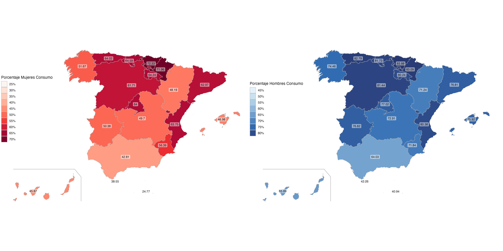

```{r setup, include=FALSE}
knitr::opts_chunk$set(echo = TRUE)
```

[REPOSITORIO EN GITHUB](https://github.com/amf1014/VAC_fuentes-de-datos.git)

# Tabla de contenidos
1. Introducción
2. Objetivos
3. Paquetes utilizados
4. Desarrollo
5. Conclusiones finales


## 1. Introducción
En España se estima que la tasa de suicidio es aproximadamente de un 13,9 por 100.000 hab/ año. Un número preocupante, pero ¿que motivos pueden llevar a dicha tragedia? 
En este seminario vamos a tratar de encontrar relación entre el suicidio, el ejercicio físico y el consumo de alcohol.


## 2. Objetivos
En un primer lugar, vamos a observar y a intentar obtener información de cada conjunto de datos por separado. 

Sobre el conjunto de datos sobre el suicidio, observamos las diferencias que hay en el número de suicidios según:

- Sexo.

- Comunidades autónomas.

Sobre el conjunto de datos sobre el consumo de alcohol, observamos las diferencias que hay en el número de consumo de alcohol según:

- Sexo.

- Comunidad autónoma.

Sobre el conjunto de datos sobre el ejercicio físico, observamos las diferencias que hay en el número de ejercicio físico que se realiza según:

- Sexo.

- Comunidades autónomas.

- Realización de ejercicio o no.

Una vez analizado por separado cada conjunto de datos, pasamos a observar si hay relación entre ellos, centrándonos especialmente en:

1.- Relación entre el suicidio y el consumo de alcohol por comunidad autónoma y por sexo.

2.- Relación entre el suicidio y el ejercicio físico por comunidad autónoma y por sexo.

3.- Relación entre el ejercicio físico y el consumo de alcohol por comunidad autónoma y por sexo.

## 3. Paquetes utilizados
A lo largo del seminario utilizamos varios paquetes:

1. El paquete "dplyr" para manipulación de datos, filtra, ordena, agrupa y resume datos:
```{r, eval = TRUE, message = FALSE, warning = FALSE}
#install.packages("dplyr") así es como lo hemos instalado.
library(dplyr)
```

2. El paquete "tidyverse" para análisis de datos, importa, limpia, transforma, visualiza y modela datos:
```{r, eval = TRUE, message = FALSE, warning = FALSE}
#install.packages("tidyverse") así es como lo hemos instalado.
library(tidyverse)
```

3. El paquere "rjson" para leer y escribir datos en formato JSON:
```{r, eval = TRUE, message = FALSE, warning = FALSE}
#install.packages("rjson") así es como lo hemos instalado.
library(rjson)
```

4. El paquete "tidyjson" para manipular datos JSON en formatp tidy:
```{r, eval = TRUE, message = FALSE, warning = FALSE}
#install.packages("tidyjson") así es como lo hemos instalado.
library(tidyjson)
```

5. El paquete "ggplot2" para visualizar datos, en formato de gráfico.
```{r, eval = TRUE, message = FALSE, warning = FALSE}
#install.packages("ggplot2") así es como lo hemos instalado.
library(ggplot2)
```

6. El paquete "mapSpain" para visualizar un gráfico con mapa específico de España:
```{r, eval = TRUE, message = FALSE, warning = FALSE}
#install.packages("mapSpain") así es como lo hemos instalado.
library(mapSpain)
```

7. El paquete "sf" para manejar datos espaciales:
```{r, eval = TRUE, message = FALSE, warning = FALSE}
#install.packages("sf") así es como lo hemos instalado.
library(sf)
```

8. El paquete "patchwork" para combinar varios gráficos en una sola salida:
```{r, eval = TRUE, message = FALSE, warning = FALSE}
#install.packages("patchwork") así es como lo hemos instalado.
library(patchwork)
```

9. El paquete "DT" para crear tablas interactivas:
```{r, eval = TRUE, message = FALSE, warning = FALSE}
#install.packages("DT") así es como lo hemos instalado.
library(DT)
```

10. El paquete "plotly" para visualización interactiva de gráficos:
```{r, eval = TRUE, message = FALSE, warning = FALSE}
#install.packages("plotly") así es como lo hemos instalado.
library(plotly)
```

## 4. Desarrollo

### Carga de datos a usar.
Vamos a trabajar con tres conjuntos de datos en formato json, por tanto cargamos cada uno de ellos.
```{r}


suicidio <- fromJSON(file = "INPUT/DATA/Suicidios_por_comunidades.json")
consumo_alcohol <- fromJSON(file = "INPUT/DATA/consumo_de_alcohol.json")
ejercicioFisico <- fromJSON(file = "INPUT/DATA/Ejercicio_fisico.json")
```

### Formateo de datos
Una vez cargados, procedemos a formatear los datos para crear tablas ordenadas con los datos que nos interesan.

#### Formateo de datos del conjunto de datos de suicidio:

```{r, eval = TRUE}

suicidio %>%
  gather_object %>%
  json_types %>%
  count(name,type)


suicidio1 <- suicidio %>%
  enter_object(Data) %>%
  gather_array %>%
  spread_all %>%
  select("document.id", "Valor")


suicidio2 <- suicidio %>%
  enter_object(MetaData) %>%
  gather_array %>%
  spread_all %>%
  select("document.id", "Nombre")
  

suicidio3 <- suicidio1 %>%
  select(c("document.id","Valor")) %>%
  full_join(x = .,
            y = suicidio2 %>%
              select(c("document.id","Nombre")),
            by = c("document.id"))

suicidio4 <- suicidio3 %>%
  mutate(
    sexo = case_when(
      Nombre == "Ambos sexos" ~ "Ambos sexos",
      Nombre == "Hombres" ~ "Hombres",
      Nombre == "Mujeres" ~ "Mujeres",
      TRUE ~ as.character(NA)
    )
  )

suicidio5 <- suicidio4 %>%
  mutate(
    años = case_when(
      Nombre == "Todas las edades" ~ "Todas las edades",
      Nombre == "Menores de 15 años" ~ "Menores de 15 años",
      Nombre == "De 15 a 29 años" ~ "De 15 a 29 años",
      Nombre == "De 30 a 39 años" ~ "De 30 a 39 años",
      Nombre == "De 40 a 44 años" ~ "De 40 a 44 años",
      Nombre == "De 45 a 49 años" ~ "De 45 a 49 años",
      Nombre == "De 50 a 54 años" ~ "De 50 a 54 años",
      Nombre == "De 55 a 59 años" ~ "De 55 a 59 años",
      Nombre == "De 60 a 64 años" ~ "De 60 a 64 años",
      Nombre == "De 65 a 69 años" ~ "De 65 a 69 años",
      Nombre == "De 70 a 74 años" ~ "De 70 a 74 años",
      Nombre == "De 75 a 79 años" ~ "De 75 a 79 años",
      Nombre == "De 80 a 84 años" ~ "De 80 a 84 años",
      Nombre == "De 85 a 89 años" ~ "De 85 a 89 años",
      Nombre == "De 90 a 94 años" ~ "De 90 a 94 años",
      Nombre == "De 95 años y más" ~ "De 95 años y más",
      TRUE ~ as.character(NA)
    )
  )

suicidio6 <- suicidio5 %>%
  mutate(
    comunidades_autonomas = case_when(
      Nombre == "Total" ~ "Total nacional",
      Nombre == "Andalucía" ~ "Andalucía",
      Nombre == "Aragón" ~ "Aragón",
      Nombre == "Asturias, Principado de" ~ "Principado de Asturias",
      Nombre == "Balears, Illes" ~ "Islas Baleares",
      Nombre == "Canarias" ~ "Islas Canarias",
      Nombre == "Cantabria" ~ "Cantabria",
      Nombre == "Castilla y León" ~ "Castilla y León",
      Nombre == "Castilla-La Mancha" ~ "Castilla-La Mancha",
      Nombre == "Cataluña" ~ "Cataluña",
      Nombre == "Comunitat Valenciana" ~ "Comunitat Valenciana",
      Nombre == "Extremadura" ~ "Extremadura",
      Nombre == "Galicia" ~ "Galicia",
      Nombre == "Madrid, Comunidad de" ~ "Madrid",
      Nombre == "Murcia, Región de" ~ "Murcia",
      Nombre == "Navarra, Comunidad Foral de" ~ "Navarra",
      Nombre == "País Vasco" ~ "País Vasco",
      Nombre == "Rioja, La" ~ "La Rioja",
      Nombre == "Ceuta" ~ "Ceuta",
      Nombre == "Melilla" ~ "Melilla",
      TRUE ~ as.character(NA)
    )
  )

suicidio7 <- 
  as.data.frame(apply(suicidio6, 2, function(col) col[!is.na(col)])) 

suicidio7 <- suicidio7[, -3]

suicidio7$Valor <- suicidio7$Valor[seq(1, length(suicidio7$Valor), by = 3)]

suicidio7$Valor <- suicidio7$Valor[seq(1, length(suicidio7$Valor), by = 16)]

suicidio7$sexo <- suicidio7$sexo[seq(1, length(suicidio7$sexo), by = 16)]

suicidio7$comunidades_autonomas <- suicidio7$comunidades_autonomas[seq(1, length(suicidio7$comunidades_autonomas), by = 16)]


suicidio8 <- suicidio7%>%
  select(-años)


suicidio9 <- suicidio8 %>%
  mutate(
    habitantes = case_when(
      comunidades_autonomas == "Total nacional" & sexo == "Ambos sexos" ~ 48592802,
      comunidades_autonomas == "Total nacional" & sexo == "Hombres" ~ 23807546,
      comunidades_autonomas == "Total nacional" & sexo == "Mujeres" ~ 24785363,
      comunidades_autonomas == "Andalucía" & sexo == "Ambos sexos" ~ 8620120,
      comunidades_autonomas == "Andalucía" & sexo == "Hombres" ~ 4238717,
      comunidades_autonomas == "Andalucía" & sexo == "Mujeres" ~ 4381403,
      comunidades_autonomas == "Aragón" & sexo == "Ambos sexos" ~ 1348918,
      comunidades_autonomas == "Aragón" & sexo == "Hombres" ~ 666949,
      comunidades_autonomas == "Aragón" & sexo == "Mujeres" ~ 681969,
      comunidades_autonomas == "Principado de Asturias" & sexo == "Ambos sexos" ~ 1008876,
      comunidades_autonomas == "Principado de Asturias" & sexo == "Hombres" ~ 481018,
      comunidades_autonomas == "Principado de Asturias" & sexo == "Mujeres" ~ 527858,
      comunidades_autonomas == "Islas Baleares" & sexo == "Ambos sexos" ~ 1231487,
      comunidades_autonomas == "Islas Baleares" & sexo == "Hombres" ~ 614011,
      comunidades_autonomas == "Islas Baleares" & sexo == "Mujeres" ~ 617476,
      comunidades_autonomas == "Islas Canarias" & sexo == "Ambos sexos" ~ 2236013,
      comunidades_autonomas == "Islas Canarias" & sexo == "Hombres" ~ 1103805,
      comunidades_autonomas == "Islas Canarias" & sexo == "Mujeres" ~ 1132208,
      comunidades_autonomas == "Cantabria" & sexo == "Ambos sexos" ~ 591151,
      comunidades_autonomas == "Cantabria" & sexo == "Hombres" ~ 286341,
      comunidades_autonomas == "Cantabria" & sexo == "Mujeres" ~ 304810,
      comunidades_autonomas == "Castilla y León" & sexo == "Ambos sexos" ~ 2389959,
      comunidades_autonomas == "Castilla y León" & sexo == "Hombres" ~ 1175016,
      comunidades_autonomas == "Castilla y León" & sexo == "Mujeres" ~ 1214943,
      comunidades_autonomas == "Castilla-La Mancha" & sexo == "Ambos sexos" ~ 2100523,
      comunidades_autonomas == "Castilla-La Mancha" & sexo == "Hombres" ~ 1053361,
      comunidades_autonomas == "Castilla-La Mancha" & sexo == "Mujeres" ~ 1047162,
      comunidades_autonomas == "Cataluña" & sexo == "Ambos sexos" ~ 8021049,
      comunidades_autonomas == "Cataluña" & sexo == "Hombres" ~ 3948555,
      comunidades_autonomas == "Cataluña" & sexo == "Mujeres" ~ 4072494,
      comunidades_autonomas == "Comunidad Valenciana" & sexo == "Ambos sexos" ~ 5316478,
      comunidades_autonomas == "Comunidad Valenciana" & sexo == "Hombres" ~ 2613918,
      comunidades_autonomas == "Comunidad Valenciana" & sexo == "Mujeres" ~ 2702560,
      comunidades_autonomas == "Extremadura" & sexo == "Ambos sexos" ~ 1053423,
      comunidades_autonomas == "Extremadura" & sexo == "Hombres" ~ 521005,
      comunidades_autonomas == "Extremadura" & sexo == "Mujeres" ~ 532418,
      comunidades_autonomas == "Galicia" & sexo == "Ambos sexos" ~ 2705877,
      comunidades_autonomas == "Galicia" & sexo == "Hombres" ~ 1301669,
      comunidades_autonomas == "Galicia" & sexo == "Mujeres" ~ 1404208,
      comunidades_autonomas == "Madrid" & sexo == "Ambos sexos" ~ 7000621,
      comunidades_autonomas == "Madrid" & sexo == "Hombres" ~ 3352591,
      comunidades_autonomas == "Madrid" & sexo == "Mujeres" ~ 3648030,
      comunidades_autonomas == "Murcia" & sexo == "Ambos sexos" ~ 1569164,
      comunidades_autonomas == "Murcia" & sexo == "Hombres" ~ 786213,
      comunidades_autonomas == "Murcia" & sexo == "Mujeres" ~ 782951,
      comunidades_autonomas == "Navarra" & sexo == "Ambos sexos" ~ 678103,
      comunidades_autonomas == "Navarra" & sexo == "Hombres" ~ 335742,
      comunidades_autonomas == "Navarra" & sexo == "Mujeres" ~ 342361,
      comunidades_autonomas == "País Vasco" & sexo == "Ambos sexos" ~ 2227581,
      comunidades_autonomas == "País Vasco" & sexo == "Hombres" ~ 1083234,
      comunidades_autonomas == "País Vasco" & sexo == "Mujeres" ~ 1144347,
      comunidades_autonomas == "La Rioja" & sexo == "Ambos sexos" ~ 324226,
      comunidades_autonomas == "La Rioja" & sexo == "Hombres" ~160074,
      comunidades_autonomas == "La Rioja" & sexo == "Mujeres" ~ 164152,
      comunidades_autonomas == "Ceuta" & sexo == "Ambos sexos" ~ 83284,
      comunidades_autonomas == "Ceuta" & sexo == "Hombres" ~ 41990,
      comunidades_autonomas == "Ceuta" & sexo == "Mujeres" ~ 41294,
      comunidades_autonomas == "Melilla" & sexo == "Ambos sexos" ~ 86056,
      comunidades_autonomas == "Melilla" & sexo == "Hombres" ~ 43337,
      comunidades_autonomas == "Melilla" & sexo == "Mujeres" ~ 42719,
      TRUE ~ as.numeric(NA)
    )
  )


suicidio10 <- suicidio9 %>%
  mutate(
    porcentaje_suicidios = (as.numeric(Valor) / habitantes) * 100 
  )

suicidio10 <- suicidio10 %>% slice(1:60)

datatable(suicidio10, options = list(pageLength = 10))
```

#### Formateo de datos del conjunto de datos del consumo de alcohol:

```{r, eval = TRUE}

consumo_alcohol_tiposresum<-consumo_alcohol %>%  
  gather_object %>% 
  json_types %>% 
  count(name, type)
consumo_alcohol_tiposresum

#consumo_alcohol_tiposresum$name[3]

consumo_alcohol1<-consumo_alcohol %>%
  enter_object(Data) %>%
  gather_array %>%
  spread_all %>%
  select("document.id", "Valor")

consumo_alcohol2<-consumo_alcohol %>%
  enter_object(MetaData) %>%
  gather_array %>%
  spread_all %>%
  select("document.id", "Nombre")

consumo_alcohol3 <- consumo_alcohol1 %>%
  select(c("document.id","Valor")) %>%
  full_join(x = .,
            y = consumo_alcohol2 %>%
              select(c("document.id","Nombre")),
            by = c("document.id"))


consumo_alcohol4 <- consumo_alcohol3 %>%
  mutate(
    Sexo = case_when(
      Nombre == "Ambos sexos" ~ "Ambos sexos",
      Nombre == "Hombres" ~ "Hombres",
      Nombre == "Mujeres" ~ "Mujeres",
      TRUE ~ as.character(NA)
    )
  )
consumo_alcohol5 <- consumo_alcohol4 %>%
  mutate(
    Comunidades_autonomas = case_when(
      Nombre == "Total" ~ "Total Nacional",
      Nombre == "Andalucía" ~ "Andalucía",
      Nombre == "Aragón" ~ "Aragón",
      Nombre == "Asturias (Principado de)" ~ "Principado de Asturias",
      Nombre == "Balears (Illes)" ~ "Islas Baleares",
      Nombre == "Canarias" ~ "Islas Canarias",
      Nombre == "Cantabria" ~ "Cantabria",
      Nombre == "Castilla y León" ~ "Castilla y León",
      Nombre == "Castilla-La Mancha" ~ "Castilla-La Mancha",
      Nombre == "Cataluña" ~ "Cataluña",
      Nombre == "Comunitat Valenciana" ~ "Comunitat Valenciana",
      Nombre == "Extremadura" ~ "Extremadura",
      Nombre == "Galicia" ~ "Galicia",
      Nombre == "Madrid (Comunidad de)" ~ "Madrid",
      Nombre == "Murcia (Región de)" ~ "Murcia",
      Nombre == "Navarra (Comunidad Foral de)" ~ "Navarra",
      Nombre == "País Vasco" ~ "País Vasco",
      Nombre == "Rioja (La)" ~ "La Rioja",
      Nombre == "Ceuta (Ciudad Autónoma de)" ~ "Ceuta",
      Nombre == "Melilla (Ciudad Autónoma de)" ~ "Melilla",
      TRUE ~ as.character(NA)
    )
  )

consumo_alcohol6 <- consumo_alcohol5 %>%
  mutate(
    Consumido = case_when(
      Nombre == "TOTAL" ~ "Total_personas_encuestadas",
      Nombre == "Sí ha consumido" ~ "Si_ha_consumido",
      Nombre == "No ha consumido" ~ "No_ha_consumido",
      Nombre == "No consta" ~ "No_consta",
      TRUE ~ as.character(NA)
    )
  )

consumo_alcohol7 <- 
  as.data.frame(apply(consumo_alcohol6, 2, function(col) col[!is.na(col)])) 


consumo_alcohol7$Valor <- consumo_alcohol7$Valor[seq(1, length(consumo_alcohol7$Valor), by = 3 )]

consumo_alcohol8<-consumo_alcohol7%>%
  pivot_wider(names_from = Consumido, values_from = Valor)

consumo_alcohol8 <- 
  as.data.frame(apply(consumo_alcohol8, 2, function(col) col[!is.na(col)])) 

consumo_alcohol8 <-consumo_alcohol8%>%
  mutate(
    `Si_ha_consumido` = as.numeric(`Si_ha_consumido`),
    `Total_personas_encuestadas` = as.numeric(`Total_personas_encuestadas`),
    `No_ha_consumido` = as.numeric(`No_ha_consumido`)
  )


consumo_alcohol9 <- consumo_alcohol8 %>%
  mutate(
    Porcentaje_consumo = (`Si_ha_consumido`/`Total_personas_encuestadas`)*100
  )

consumo_alcohol10 <- consumo_alcohol9 %>%
  mutate(
    Porcentaje_no_consumo = (`No_ha_consumido`/`Total_personas_encuestadas`)*100
  )

consumo_alcohol10 <- consumo_alcohol10[, -2]#Borra columna Nombre

consumo_alcohol_final_tabla <- consumo_alcohol10 %>% slice(1:720)

datatable(consumo_alcohol_final_tabla, options = list(pageLength = 10))
```

#### Formateo de datos del conjunto de datos de ejercicio físico:

```{r, eval = TRUE}

tiposEjercicioFisico_visiongeneral<-ejercicioFisico%>% 
  gather_object %>% 
  json_types

tiposEjercicioFisico <- ejercicioFisico %>%
  gather_object %>% 
  json_types %>% 
  count(name, type)

nombresEjercicioFisico <- ejercicioFisico %>%
  enter_object(Nombre)

ejercicioFisicoData <- ejercicioFisico %>%
  enter_object(Data) %>%
  gather_array %>%
  spread_all%>%
  select(-array.index)

ejercicioFisicoMetaData <-ejercicioFisico %>%
  enter_object(MetaData) %>%
  gather_array %>%
  spread_all %>%
  select(document.id, Nombre)

ejercicioFisicoUnion <- left_join(ejercicioFisicoMetaData, ejercicioFisicoData, by="document.id")

ejercicioFisicoUnion <- ejercicioFisicoUnion %>%
  mutate(
    Sexo = case_when(
      Nombre == "Ambos sexos" ~ "Ambos sexos",
      Nombre == "Hombres" ~ "Hombres",
      Nombre == "Mujeres" ~ "Mujeres",
      TRUE ~ as.character(NA)
    ),
    `Comunidades_autonomas` = case_when(
      Nombre == "Total" ~ "Total Nacional",
      Nombre == "Andalucía" ~ "Andalucía",
      Nombre == "Aragón" ~ "Aragón",
      Nombre == "Asturias (Principado de)" ~ "Principado de Asturias",
      Nombre == "Balears (Illes)" ~ "Islas Baleares",
      Nombre == "Canarias" ~ "Islas Canarias",
      Nombre == "Cantabria" ~ "Cantabria",
      Nombre == "Castilla y León" ~ "Castilla y León",
      Nombre == "Castilla-La Mancha" ~ "Castilla-La Mancha",
      Nombre == "Cataluña" ~ "Cataluña",
      Nombre == "Comunitat Valenciana" ~ "Comunidad Valenciana",
      Nombre == "Extremadura" ~ "Extremadura",
      Nombre == "Galicia" ~ "Galicia",
      Nombre == "Madrid (Comunidad de)" ~ "Madrid",
      Nombre == "Murcia (Región de)" ~ "Murcia",
      Nombre == "Navarra (Comunidad Foral de)" ~ "Navarra",
      Nombre == "País Vasco" ~ "País Vasco",
      Nombre == "Rioja (La)" ~ "La Rioja",
      Nombre == "Ceuta (Ciudad Autónoma de)" ~ "Ceuta",
      Nombre == "Melilla (Ciudad Autónoma de)" ~ "Melilla",
      TRUE ~ as.character(NA)
    ),
    `Frecuencia_de_ejercicio` = case_when(
      Nombre == "TOTAL" ~ "TOTAL",
      Nombre == "Ninguno" ~ "Ninguno",
      Nombre == "1 o 2 días a la semana" ~ "1 o 2 días a la semana",
      Nombre == "3 o 4 días a la semana" ~ "3 o 4 días a la semana",
      Nombre == "5 o 6 días a la semana" ~ "5 o 6 días a la semana",
      Nombre == "7 días a la semana" ~ "7 días a la semana",
      TRUE ~ as.character(NA)
    )
  )


ejercicioFisicoUnion <- ejercicioFisicoUnion %>%
  fill(Sexo, `Comunidades_autonomas`, `Frecuencia_de_ejercicio`, .direction = "up")

ejercicioFisicoUnion <- filter(ejercicioFisicoUnion, ejercicioFisicoUnion$Nombre == ejercicioFisicoUnion$Sexo)

ejercicioFisicoUnion <- ejercicioFisicoUnion %>%
  select(-Nombre,-document.id)%>%
  rename("Miles_de_personas"=Valor)

totalPersonasComunidad <- ejercicioFisicoUnion %>%
  filter(`Frecuencia_de_ejercicio` == "TOTAL") %>%
  select(`Comunidades_autonomas`, `Total_personas_según_la_comunidad` = `Miles_de_personas`)

duplicated(totalPersonasComunidad)

totalPersonasComunidad <- totalPersonasComunidad %>%
  distinct(`Comunidades_autonomas`, .keep_all = TRUE)

ejercicioFisicoUnion <- left_join(ejercicioFisicoUnion, totalPersonasComunidad, by="Comunidades_autonomas")

ejercicioFisicoUnion <- ejercicioFisicoUnion %>%
  mutate(
    Ratio = `Miles_de_personas` / `Total_personas_según_la_comunidad`,
    Porcentaje = Ratio * 100
  )%>%
  select(-`Total_personas_según_la_comunidad`)

ejercicioFisicoUnionFinal <- ejercicioFisicoUnion %>%
  select(-Miles_de_personas, -Ratio)

ejercicioFisicoUnionFinal <- ejercicioFisicoUnionFinal %>% slice(1:360)

datatable(ejercicioFisicoUnionFinal, options = list(pageLength = 10))
```


### Análisis de datos

Una vez formateados los datos, pasamos a analizarlos:

#### Para el conjunto de datos de suicidio:

```{r, eval = TRUE}
suicidio_por_sexo <- suicidio10 %>%
  group_by(sexo) %>%
  summarize(suicidio_medio_sexo=mean(as.numeric(porcentaje_suicidios), na.rm = TRUE))


suicidio_por_comunidad <- suicidio10 %>%
  group_by(comunidades_autonomas) %>%
  summarize(suicidio_medio_comunidad=mean(as.numeric(porcentaje_suicidios), na.rm = TRUE))


suicidio_por_sexo_comunidad <- suicidio10 %>%
  group_by(sexo, comunidades_autonomas) %>%
  summarize(suicidio_medio_sexo_comunidad=mean(as.numeric(porcentaje_suicidios), na.rm = TRUE))

census <- mapSpain::pobmun19

codelist <- mapSpain::esp_codelist %>%
  select(cpro, codauto) %>%
  distinct()

census_ccaa <- census %>%
  left_join(codelist) %>%
  group_by(codauto) %>%
  summarise(pob19 = sum(pob19), men = sum(men), women = sum(women)) %>%
  mutate(
    porc_women = women / pob19,
    porc_women_lab = paste0(round(100 * porc_women, 2), "%")
  )
ccaa_sf <- esp_get_ccaa() %>%
  left_join(census_ccaa)
can <- esp_get_can_box()


suicidio10 <- suicidio10 %>%
  mutate(comunidades_autonomas = case_when(
    comunidades_autonomas == "Islas Baleares" ~ "Balears, Illes",
    comunidades_autonomas == "Islas Canarias" ~ "Canarias",
    comunidades_autonomas == "Castilla-La Mancha" ~ "Castilla - La Mancha",
    comunidades_autonomas == "Principado de Asturias" ~ "Asturias, Principado de",
    comunidades_autonomas == "Comunidad Valenciana" ~ "Comunitat Valenciana",
    comunidades_autonomas == "Madrid" ~ "Madrid, Comunidad de",
    comunidades_autonomas == "Murcia" ~ "Murcia, Región de",
    comunidades_autonomas == "Navarra" ~ "Navarra, Comunidad Foral de",
    comunidades_autonomas == "La Rioja" ~ "Rioja, La",
    TRUE ~ comunidades_autonomas
  ))

suicidio_global <- suicidio10 %>%
  filter(sexo == "Ambos sexos") %>%
  group_by(comunidades_autonomas)%>%
  summarize(porcentaje_global_suicidios = mean(porcentaje_suicidios, na.rm = TRUE))

suicidio_mujeres <- suicidio10 %>%
  filter(sexo == "Mujeres") %>%
  group_by(comunidades_autonomas) %>%
  summarize(
    porcentaje_mujeres_suicidios = mean(porcentaje_suicidios, na.rm = TRUE)
  )

suicidio_hombres <- suicidio10 %>%
  filter(sexo == "Hombres") %>%
  group_by(comunidades_autonomas)%>%
  summarize(porcentaje_hombres_suicidios = mean(porcentaje_suicidios, na.rm = TRUE))

levels(factor(ccaa_sf$ine.ccaa.name))
levels(factor(suicidio_mujeres$comunidades_autonomas))

ccaa_sf <- esp_get_ccaa() %>%
  left_join(suicidio_mujeres, by = c("ine.ccaa.name" = "comunidades_autonomas"))

ccaa_sm <- esp_get_ccaa() %>%
  left_join(suicidio_hombres, by = c("ine.ccaa.name" = "comunidades_autonomas"))

ccaa_sg <- esp_get_ccaa() %>%
  left_join(suicidio_global, by = c("ine.ccaa.name" = "comunidades_autonomas"))


```

#### Para el conjunto de datos de consumo de alcohol:
```{r, eval = TRUE}


consumo_alcohol10$Comunidades_autonomas <- consumo_alcohol10$Comunidades_autonomas[seq(1, length(consumo_alcohol10$Comunidades_autonomas), by =  4)]
consumo_alcohol10$Sexo <- consumo_alcohol10$Sexo[seq(1, length(consumo_alcohol10$Sexo), by =  4)]

census_2 <- mapSpain::pobmun19

codelist_2 <- mapSpain::esp_codelist %>%
  select(cpro, codauto) %>%
  distinct()

census_ccaa_2 <- census_2 %>%
  left_join(codelist_2) %>%
  group_by(codauto) %>%
  summarise(pob19 = sum(pob19), men = sum(men), women = sum(women)) %>%
  mutate(
    porc_women = women / pob19,
    porc_women_lab = paste0(round(100 * porc_women, 2), "%")
  )
ccaa_sf_2 <- esp_get_ccaa() %>%
  left_join(census_ccaa_2)
can_2 <- esp_get_can_box()

consumo_alcohol10 <- consumo_alcohol10 %>%
  mutate(Comunidades_autonomas = case_when(
    Comunidades_autonomas == "Islas Baleares" ~ "Balears, Illes",
    Comunidades_autonomas == "Islas Canarias" ~ "Canarias",
    Comunidades_autonomas == "Castilla-La Mancha" ~ "Castilla - La Mancha",
    Comunidades_autonomas == "Principado de Asturias" ~ "Asturias, Principado de",
    Comunidades_autonomas == "Comunidad Valenciana" ~ "Comunitat Valenciana",
    Comunidades_autonomas == "Madrid" ~ "Madrid, Comunidad de",
    Comunidades_autonomas == "Murcia" ~ "Murcia, Región de",
    Comunidades_autonomas == "Navarra" ~ "Navarra, Comunidad Foral de",
    Comunidades_autonomas == "La Rioja" ~ "Rioja, La",
    Comunidades_autonomas == "Total Nacional" ~ "Total nacional",
    TRUE ~ Comunidades_autonomas
  ))

consumo_global <- consumo_alcohol10 %>%
  filter(Sexo == "Ambos sexos") %>%
  group_by(Comunidades_autonomas)%>%
  summarize(Porcentaje_global_consumo = mean(Porcentaje_consumo, na.rm = TRUE))


no_consumo_global <- consumo_alcohol10 %>%
  filter(Sexo == "Ambos sexos") %>%
  group_by(Comunidades_autonomas)%>%
  summarize(Porcentaje_global_no_consumo = mean(Porcentaje_no_consumo, na.rm = TRUE))


consumo_mujeres <- consumo_alcohol10 %>%
  filter(Sexo == "Mujeres") %>%
  group_by(Comunidades_autonomas) %>%
  summarize(Porcentaje_mujeres_consumo = mean(Porcentaje_consumo, na.rm = TRUE))

consumo_hombres <- consumo_alcohol10 %>%
  filter(Sexo == "Hombres") %>%
  group_by(Comunidades_autonomas)%>%
  summarize(Porcentaje_hombres_consumo = mean(Porcentaje_consumo, na.rm = TRUE))

levels(factor(ccaa_sf_2$ine.ccaa.name))
levels(factor(consumo_mujeres$Comunidades_autonomas))

ccaa_sf_2 <- esp_get_ccaa() %>%
  left_join(consumo_mujeres, by = c("ine.ccaa.name" = "Comunidades_autonomas"))

ccaa_sm_2 <- esp_get_ccaa() %>%
  left_join(consumo_hombres, by = c("ine.ccaa.name" = "Comunidades_autonomas"))

ccaa_sg_2 <- esp_get_ccaa() %>%
  left_join(consumo_global, by = c("ine.ccaa.name" = "Comunidades_autonomas"))

consumo_por_sexo <- consumo_alcohol10 %>%
  group_by(Sexo) %>%
  summarize(consumo_medio_sexo = mean(Porcentaje_consumo, na.rm = TRUE)) 

consumo_por_comunidad <- consumo_alcohol10 %>%
  group_by(Comunidades_autonomas) %>%
  summarize(consumo_medio_comunidad = mean(Porcentaje_consumo, na.rm = TRUE))

consumo_por_sexo_comunidad <- consumo_alcohol10 %>%
  group_by(Sexo, Comunidades_autonomas) %>%
  summarize(consumo_medio_sexo_comunidad = mean(Porcentaje_consumo, na.rm = TRUE))
```

#### Para el conjunto de datos de ejercicio físico:
```{r, eval = TRUE}
ejercicioMinimoUnaVez <- ejercicioFisicoUnion%>%
  rename(sexo = Sexo, comunidades_autonomas=Comunidades_autonomas)%>%
  filter(sexo!="Ambos sexos", Frecuencia_de_ejercicio!='TOTAL', Frecuencia_de_ejercicio!='Ninguno', comunidades_autonomas!='Total Nacional')%>%
  select(-Miles_de_personas,-Porcentaje)

ejercicioNada <- ejercicioFisicoUnion%>%
  rename(sexo = Sexo, comunidades_autonomas=Comunidades_autonomas)%>%
  filter(sexo!="Ambos sexos", Frecuencia_de_ejercicio=='Ninguno', comunidades_autonomas!='Total Nacional')%>%
  select(-Miles_de_personas,-Porcentaje)

realizacion_ejercicio_por_comunidad <- ejercicioMinimoUnaVez %>%
  group_by(comunidades_autonomas) %>%
  summarize(ejercicio_medio_comunidad=sum(as.numeric(Ratio), na.rm = TRUE)/2)

nada_ejercicio_por_comunidad <- ejercicioNada %>%
  group_by(comunidades_autonomas) %>%
  summarize(ejercicio_medio_comunidad=sum(as.numeric(Ratio), na.rm = TRUE)/2)

realizacion_ejercicio_por_sexo <- ejercicioMinimoUnaVez %>%
  group_by(sexo) %>%
  summarize(ejercicio_medio_sexo=sum(as.numeric(Ratio), na.rm = TRUE)/19)

ejercicioHombres <- ejercicioFisicoUnion%>%
  filter(Sexo=="Hombres")%>%
  select(-Ratio, -Miles_de_personas, -Sexo)

ejercicioHombres <- ejercicioHombres%>%
  filter(Frecuencia_de_ejercicio!="TOTAL")

ejercicioMujeres <- ejercicioFisicoUnion%>%
  filter(Sexo=="Mujeres")%>%
  select(-Ratio, -Miles_de_personas, Sexo)

ejercicioMujeres <- ejercicioMujeres%>%
  filter(Frecuencia_de_ejercicio!="TOTAL")

frecuenciaNadaYMaxEjercicioComunidad <- ejercicioFisicoUnion%>%
  mutate(
    NadaMax = case_when(
      `Frecuencia_de_ejercicio` == "Ninguno" ~ `Ratio`,
      `Frecuencia_de_ejercicio` == "7 días a la semana" ~ `Ratio`,
      TRUE ~ as.double(NA)
    ))%>%
  select(`Comunidades_autonomas`,Sexo,`Frecuencia_de_ejercicio`,`Ratio`, NadaMax) %>%
  filter(!is.na(NadaMax))

NadaYMaxEjercicioSexoSinNacional <- frecuenciaNadaYMaxEjercicioComunidad%>%
  filter(Comunidades_autonomas!="Total Nacional")%>%
  select(-NadaMax)

NadaEjercicioSexoSinNacional <- NadaYMaxEjercicioSexoSinNacional%>%
  filter(Frecuencia_de_ejercicio=="Ninguno")

ejercicio_min_por_sexo <- NadaEjercicioSexoSinNacional %>%
  group_by(Sexo) %>%
  summarize(Nada_de_ejercicio=sum(as.numeric(Ratio), na.rm = TRUE)/19)

MaxEjercicioSexoSinNacional <- NadaYMaxEjercicioSexoSinNacional%>%
  filter(Frecuencia_de_ejercicio=="7 días a la semana")

ejercicio_max_por_sexo <- MaxEjercicioSexoSinNacional %>%
  group_by(Sexo) %>%
  summarize(Maximo_ejercicio=mean(as.numeric(Ratio), na.rm = TRUE))

ComparacionNadaYMaxEjercicio <- frecuenciaNadaYMaxEjercicioComunidad%>%
  spread(`Frecuencia_de_ejercicio`, Ratio)%>%
  fill(`7 días a la semana`,`Ninguno`, .direction = "up")%>%
  filter(NadaMax==`7 días a la semana`)%>%
  mutate(
    `Comparacion nada y máximo ejercicio por comunidad y sexo` = `Ninguno` - `7 días a la semana`
  )%>%
  select(-NadaMax)

ComparacionNadaYMaxEjercicio <- ComparacionNadaYMaxEjercicio%>%
  mutate(
    `Porcentaje nada y máximo ejercicio` = ComparacionNadaYMaxEjercicio$`Comparacion nada y máximo ejercicio por comunidad y sexo`*100)

ComparacionNadaYMaxEjercicio <- ComparacionNadaYMaxEjercicio %>%
  filter(Comunidades_autonomas!="Total Nacional")

NadaFrenteMaxEjercicioHombres <- ComparacionNadaYMaxEjercicio%>%
  filter(Sexo=="Hombres")%>%
  select(-`Comparacion nada y máximo ejercicio por comunidad y sexo`)

ExtremosEjercicioHombres <- NadaFrenteMaxEjercicioHombres%>%
  pivot_longer(
    cols = c("7 días a la semana", "Ninguno"), 
    names_to = "Ejercicio_fisico",            
    values_to = "Valor"                     
  )%>%
  select(-`Porcentaje nada y máximo ejercicio`)

NadaFrenteMaxEjercicioMujeres <- ComparacionNadaYMaxEjercicio%>%
  filter(Sexo=="Mujeres")%>%
  select(-`Comparacion nada y máximo ejercicio por comunidad y sexo`)

ExtremosEjercicioMujeres <- NadaFrenteMaxEjercicioMujeres%>%
  pivot_longer(
    cols = c("7 días a la semana", "Ninguno"), 
    names_to = "Ejercicio_fisico",            
    values_to = "Valor"                     
  )%>%
  select(-`Porcentaje nada y máximo ejercicio`)

ExtremosRealizacionEjercicio <- left_join(ExtremosEjercicioHombres, ExtremosEjercicioMujeres, by=c("Comunidades_autonomas"))

ExtremosUnion <- ExtremosRealizacionEjercicio %>%
  pivot_longer(
    cols = starts_with("Valor"),  
    names_to = "Sexo",            
    values_to = "Valor"           
  )%>%
  mutate(
    Sexo = ifelse(Sexo == "Valor.x","Hombres", "Mujeres"))%>%
  select(-`Sexo.x`,-`Sexo.y`)%>%
  distinct(Comunidades_autonomas, Sexo, Valor,.keep_all = TRUE)

ExtremosUnion <- ExtremosUnion%>%
  mutate(
    Frecuencia_Ejercicio = case_when(
      Sexo == "Mujeres" ~ Ejercicio_fisico.y, 
      Sexo == "Hombres" ~ Ejercicio_fisico.x
    ))

ExtremosUnion <- ExtremosUnion %>%
  pivot_longer(cols = starts_with("Ejercicio_fisico"),
               values_to = "FrecuenciasExtremo")%>%
  select(-`name`)

ExtremosUnionFinal <- ExtremosUnion%>%
  filter(`Frecuencia_Ejercicio` == `FrecuenciasExtremo`) %>%
  distinct()%>%
  select(-`Frecuencia_Ejercicio`)

ExtremosUnionFinal <- ExtremosUnionFinal%>%
  mutate(
    Porcentaje = Valor*100
  )%>%
  select(-`Valor`)


RepresentacionExtremosEjercicio <- ggplot(ExtremosUnionFinal, aes(Comunidades_autonomas,Porcentaje))+
  geom_point(aes(colour=factor(Sexo), shape = factor(FrecuenciasExtremo)))+
  labs(title = "Ejercicio físico extremos por Sexo y Comunidad Autónoma",x = "Comunidad Autónoma",y = "Porcentaje de individuos", colour = "Sexo", shape = "Frecuencias de ejercicio") +
  theme_minimal() +
  theme(axis.text.x = element_text(angle = 45, hjust = 1))


nada_ejercicio_por_comunidad <- nada_ejercicio_por_comunidad%>%
  mutate(comunidades_autonomas = case_when(
    comunidades_autonomas == "Islas Baleares" ~ "Balears, Illes",
    comunidades_autonomas == "Islas Canarias" ~ "Canarias",
    comunidades_autonomas == "Castilla-La Mancha" ~ "Castilla - La Mancha",
    comunidades_autonomas == "Principado de Asturias" ~ "Asturias, Principado de",
    comunidades_autonomas == "Comunidad Valenciana" ~ "Comunitat Valenciana",
    comunidades_autonomas == "Madrid" ~ "Madrid, Comunidad de",
    comunidades_autonomas == "Murcia" ~ "Murcia, Región de",
    comunidades_autonomas == "Navarra" ~ "Navarra, Comunidad Foral de",
    comunidades_autonomas == "La Rioja" ~ "Rioja, La",
    TRUE ~ comunidades_autonomas
  ))

realizacion_ejercicio_por_comunidad <- realizacion_ejercicio_por_comunidad%>%
  mutate(comunidades_autonomas = case_when(
    comunidades_autonomas == "Islas Baleares" ~ "Balears, Illes",
    comunidades_autonomas == "Islas Canarias" ~ "Canarias",
    comunidades_autonomas == "Castilla-La Mancha" ~ "Castilla - La Mancha",
    comunidades_autonomas == "Principado de Asturias" ~ "Asturias, Principado de",
    comunidades_autonomas == "Comunidad Valenciana" ~ "Comunitat Valenciana",
    comunidades_autonomas == "Madrid" ~ "Madrid, Comunidad de",
    comunidades_autonomas == "Murcia" ~ "Murcia, Región de",
    comunidades_autonomas == "Navarra" ~ "Navarra, Comunidad Foral de",
    comunidades_autonomas == "La Rioja" ~ "Rioja, La",
    TRUE ~ comunidades_autonomas
  ))

ejercicioMinimoUnaVez <- ejercicioMinimoUnaVez%>%
  mutate(comunidades_autonomas = case_when(
    comunidades_autonomas == "Islas Baleares" ~ "Balears, Illes",
    comunidades_autonomas == "Islas Canarias" ~ "Canarias",
    comunidades_autonomas == "Castilla-La Mancha" ~ "Castilla - La Mancha",
    comunidades_autonomas == "Principado de Asturias" ~ "Asturias, Principado de",
    comunidades_autonomas == "Comunidad Valenciana" ~ "Comunitat Valenciana",
    comunidades_autonomas == "Madrid" ~ "Madrid, Comunidad de",
    comunidades_autonomas == "Murcia" ~ "Murcia, Región de",
    comunidades_autonomas == "Navarra" ~ "Navarra, Comunidad Foral de",
    comunidades_autonomas == "La Rioja" ~ "Rioja, La",
    TRUE ~ comunidades_autonomas
  ))


frecuenciaNadaYMaxEjercicioComunidad <- frecuenciaNadaYMaxEjercicioComunidad%>%
  mutate(Porcentaje = Ratio * 100) %>%
  select(-Ratio,-NadaMax)%>%
  rename(comunidades_autonomas=Comunidades_autonomas)

frecuenciaNadaYMaxEjercicioComunidad <- frecuenciaNadaYMaxEjercicioComunidad%>%
  mutate(comunidades_autonomas = case_when(
    comunidades_autonomas == "Islas Baleares" ~ "Balears, Illes",
    comunidades_autonomas == "Islas Canarias" ~ "Canarias",
    comunidades_autonomas == "Castilla-La Mancha" ~ "Castilla - La Mancha",
    comunidades_autonomas == "Principado de Asturias" ~ "Asturias, Principado de",
    comunidades_autonomas == "Comunidad Valenciana" ~ "Comunitat Valenciana",
    comunidades_autonomas == "Madrid" ~ "Madrid, Comunidad de",
    comunidades_autonomas == "Murcia" ~ "Murcia, Región de",
    comunidades_autonomas == "Navarra" ~ "Navarra, Comunidad Foral de",
    comunidades_autonomas == "La Rioja" ~ "Rioja, La",
    comunidades_autonomas == "Total Nacional" ~ "Total nacional",
    TRUE ~ comunidades_autonomas
  ))


frecuenciaNadaYMaxEjercicioComunidad <- frecuenciaNadaYMaxEjercicioComunidad%>%
  rename(Comunidades_autonomas=comunidades_autonomas)

ejercicioMujeres <- ejercicioMujeres%>%
  mutate(Comunidades_autonomas = case_when(
    Comunidades_autonomas == "Islas Baleares" ~ "Balears, Illes",
    Comunidades_autonomas == "Islas Canarias" ~ "Canarias",
    Comunidades_autonomas == "Castilla-La Mancha" ~ "Castilla - La Mancha",
    Comunidades_autonomas == "Principado de Asturias" ~ "Asturias, Principado de",
    Comunidades_autonomas == "Comunidad Valenciana" ~ "Comunitat Valenciana",
    Comunidades_autonomas == "Madrid" ~ "Madrid, Comunidad de",
    Comunidades_autonomas == "Murcia" ~ "Murcia, Región de",
    Comunidades_autonomas == "Navarra" ~ "Navarra, Comunidad Foral de",
    Comunidades_autonomas == "La Rioja" ~ "Rioja, La",
    Comunidades_autonomas == "Total Nacional" ~ "Total nacional",
    TRUE ~ Comunidades_autonomas
  ))

ejercicioMujeresNinguno <- ejercicioMujeres%>%
  filter(Frecuencia_de_ejercicio=="Ninguno")%>%
  select(-Frecuencia_de_ejercicio)%>%
  rename(Ninguno = Porcentaje)

ejercicioMujeresEjercicio <- ejercicioMujeres%>%
  filter(Frecuencia_de_ejercicio!="Ninguno")%>%
  group_by(Comunidades_autonomas) %>%
  summarize(Porcentaje=sum(as.numeric(Porcentaje), na.rm = TRUE))


ejercicioHombres <- ejercicioHombres%>%
  mutate(Comunidades_autonomas = case_when(
    Comunidades_autonomas == "Islas Baleares" ~ "Balears, Illes",
    Comunidades_autonomas == "Islas Canarias" ~ "Canarias",
    Comunidades_autonomas == "Castilla-La Mancha" ~ "Castilla - La Mancha",
    Comunidades_autonomas == "Principado de Asturias" ~ "Asturias, Principado de",
    Comunidades_autonomas == "Comunidad Valenciana" ~ "Comunitat Valenciana",
    Comunidades_autonomas == "Madrid" ~ "Madrid, Comunidad de",
    Comunidades_autonomas == "Murcia" ~ "Murcia, Región de",
    Comunidades_autonomas == "Navarra" ~ "Navarra, Comunidad Foral de",
    Comunidades_autonomas == "La Rioja" ~ "Rioja, La",
    Comunidades_autonomas == "Total Nacional" ~ "Total nacional",
    TRUE ~ Comunidades_autonomas
  ))

ejercicioHombresNinguno <- ejercicioHombres%>%
  filter(Frecuencia_de_ejercicio=="Ninguno")%>%
  select(-Frecuencia_de_ejercicio)%>%
  rename(Ninguno = Porcentaje)

ejercicioHombresEjercicio <- ejercicioHombres%>%
  filter(Frecuencia_de_ejercicio!="Ninguno")%>%
  group_by(Comunidades_autonomas) %>%
  summarize(Porcentaje=sum(as.numeric(Porcentaje), na.rm = TRUE))


ejercicioAmbosSexos <- ejercicioFisicoUnion%>%
  filter(Sexo=="Ambos sexos")%>%
  select(-Ratio, -Miles_de_personas, Sexo)

ejercicioAmbosSexos <- ejercicioAmbosSexos%>%
  filter(Frecuencia_de_ejercicio!="TOTAL")

ejercicioAmbosSexos <- ejercicioAmbosSexos%>%
  mutate(Comunidades_autonomas = case_when(
    Comunidades_autonomas == "Islas Baleares" ~ "Balears, Illes",
    Comunidades_autonomas == "Islas Canarias" ~ "Canarias",
    Comunidades_autonomas == "Castilla-La Mancha" ~ "Castilla - La Mancha",
    Comunidades_autonomas == "Principado de Asturias" ~ "Asturias, Principado de",
    Comunidades_autonomas == "Comunidad Valenciana" ~ "Comunitat Valenciana",
    Comunidades_autonomas == "Madrid" ~ "Madrid, Comunidad de",
    Comunidades_autonomas == "Murcia" ~ "Murcia, Región de",
    Comunidades_autonomas == "Navarra" ~ "Navarra, Comunidad Foral de",
    Comunidades_autonomas == "La Rioja" ~ "Rioja, La",
    Comunidades_autonomas == "Total Nacional" ~ "Total nacional",
    TRUE ~ Comunidades_autonomas
  ))


ejercicioAmbosSexosNinguno <- ejercicioAmbosSexos%>%
  filter(Frecuencia_de_ejercicio=="Ninguno")%>%
  select(-Frecuencia_de_ejercicio)%>%
  rename(Ninguno = Porcentaje)

ejercicioAmbosSexosEjercicio <- ejercicioAmbosSexos%>%
  filter(Frecuencia_de_ejercicio!="Ninguno")%>%
  group_by(Comunidades_autonomas) %>%
  summarize(Porcentaje=sum(as.numeric(Porcentaje), na.rm = TRUE))

porcentaje_nada_ejercicio_por_comunidad <- nada_ejercicio_por_comunidad %>%
  mutate(porcentaje_ejercicio_medio_comunidad = ejercicio_medio_comunidad*100)%>%
  select(-ejercicio_medio_comunidad)

porcentaje_realizacion_ejercicio_por_comunidad <- realizacion_ejercicio_por_comunidad %>%
  mutate(porcentaje_ejercicio_medio_comunidad = ejercicio_medio_comunidad*100)%>%
  select(-ejercicio_medio_comunidad)

porcentaje_realizacion_ejercicio_sexo_comunidad <- ejercicioMinimoUnaVez%>%
  group_by(comunidades_autonomas,sexo) %>%
  summarize(ejercicio_medio_comunidad=sum(as.numeric(Ratio), na.rm = TRUE))%>%
  mutate(porcentaje_ejercicio_medio_comunidad = ejercicio_medio_comunidad*100)%>%
  select(-ejercicio_medio_comunidad)

mujeres_ejercicio_comunidad <- porcentaje_realizacion_ejercicio_sexo_comunidad %>%
  filter(sexo=="Mujeres")

hombres_ejercicio_comunidad <- porcentaje_realizacion_ejercicio_sexo_comunidad %>%
  filter(sexo=="Hombres")

porcentaje_realizacion_nada_ejercicio_sexo_comunidad <- ejercicioNada%>%
  group_by(comunidades_autonomas,sexo) %>%
  summarize(ejercicio_medio_comunidad=sum(as.numeric(Ratio), na.rm = TRUE))

mujeres_nada_ejercicio_comunidad <- porcentaje_realizacion_nada_ejercicio_sexo_comunidad %>%
  filter(sexo=="Mujeres")

hombres_nada_ejercicio_comunidad <- porcentaje_realizacion_nada_ejercicio_sexo_comunidad %>%
  filter(sexo=="Hombres")

levels(factor(ccaa_sf$ine.ccaa.name))
levels(factor(porcentaje_nada_ejercicio_por_comunidad$comunidades_autonomas))

ccaa_nada <- esp_get_ccaa() %>%
  left_join(porcentaje_nada_ejercicio_por_comunidad, by = c("ine.ccaa.name" = "comunidades_autonomas"))

ccaa_ejercicio <- esp_get_ccaa() %>%
  left_join(porcentaje_realizacion_ejercicio_por_comunidad, by = c("ine.ccaa.name" = "comunidades_autonomas"))

levels(factor(ccaa_sf$ine.ccaa.name))
levels(factor(mujeres_ejercicio_comunidad$comunidades_autonomas))

ccaa_m_ejercicio <- esp_get_ccaa() %>%
  left_join(mujeres_ejercicio_comunidad, by = c("ine.ccaa.name" = "comunidades_autonomas"))

levels(factor(ccaa_sf$ine.ccaa.name))
levels(factor(hombres_ejercicio_comunidad$comunidades_autonomas))

ccaa_h_ejercicio <- esp_get_ccaa() %>%
  left_join(hombres_ejercicio_comunidad, by = c("ine.ccaa.name" = "comunidades_autonomas"))
```


### Formateo de datos entre los diferentes conjuntos de datos

#### Formateo de datos para relacionar suicidio y consumo de alcohol.

```{r, eval = TRUE}
no_consumo_global <- consumo_alcohol10 %>%
  filter(Sexo == "Ambos sexos") %>%
  group_by(Comunidades_autonomas)%>%
  summarize(Porcentaje_global_no_consumo = mean(Porcentaje_no_consumo, na.rm = TRUE))

no_consumo_mujeres <- consumo_alcohol10 %>%
  filter(Sexo == "Mujeres") %>%
  group_by(Comunidades_autonomas) %>%
  summarize(Porcentaje_mujeres_no_consumo = mean(Porcentaje_no_consumo, na.rm = TRUE))

no_consumo_hombres <- consumo_alcohol10 %>%
  filter(Sexo == "Hombres") %>%
  group_by(Comunidades_autonomas)%>%
  summarize(Porcentaje_hombres_no_consumo = mean(Porcentaje_no_consumo, na.rm = TRUE))

suicidio_global_mujeres <- suicidio_global %>%
  left_join(suicidio_mujeres, by = "comunidades_autonomas")

suicidio_final <- suicidio_global_mujeres %>%
  left_join(suicidio_hombres, by = "comunidades_autonomas")

suicidio_alcohol <- suicidio_final %>%
  left_join(consumo_global, by = c("comunidades_autonomas" = "Comunidades_autonomas"))

suicidio_alcohol2 <- suicidio_alcohol %>%
  left_join(consumo_mujeres, by = c("comunidades_autonomas" = "Comunidades_autonomas"))

suicidio_alcohol3 <- suicidio_alcohol2 %>%
  left_join(consumo_hombres, by = c("comunidades_autonomas" = "Comunidades_autonomas"))

suicidio_alcohol4 <- suicidio_alcohol3 %>%
  left_join(no_consumo_global, by = c("comunidades_autonomas" = "Comunidades_autonomas"))

suicidio_alcohol5 <- suicidio_alcohol4 %>%
  left_join(no_consumo_mujeres, by = c("comunidades_autonomas" = "Comunidades_autonomas"))

suicidio_alcohol_final <- suicidio_alcohol5 %>%
  left_join(no_consumo_hombres, by = c("comunidades_autonomas" = "Comunidades_autonomas"))


suicidio_alcohol_final_2 <- suicidio_alcohol_final %>%
  pivot_longer(cols = c(porcentaje_global_suicidios, Porcentaje_global_consumo),
               names_to = "tipo_de_porcentaje",
               values_to = "porcentaje")

suicidio_alcohol_final_3 <- suicidio_alcohol_final %>%
  pivot_longer(cols = c(porcentaje_mujeres_suicidios, Porcentaje_mujeres_consumo),
               names_to = "tipo_de_porcentaje",
               values_to = "porcentaje")

suicidio_alcohol_final_4 <- suicidio_alcohol_final %>%
  pivot_longer(cols = c(porcentaje_hombres_suicidios, Porcentaje_hombres_consumo),
               names_to = "tipo_de_porcentaje",
               values_to = "porcentaje")
```

#### Formateo de datos para relacionar ejercicio fisico y suicidio.
```{r, eval = TRUE}
suicidio_por_comunidad_cambiado <- suicidio_por_comunidad%>%
  mutate(comunidades_autonomas = case_when(
    comunidades_autonomas == "Islas Baleares" ~ "Balears, Illes",
    comunidades_autonomas == "Islas Canarias" ~ "Canarias",
    comunidades_autonomas == "Castilla-La Mancha" ~ "Castilla - La Mancha",
    comunidades_autonomas == "Principado de Asturias" ~ "Asturias, Principado de",
    comunidades_autonomas == "Comunidad Valenciana" ~ "Comunitat Valenciana",
    comunidades_autonomas == "Madrid" ~ "Madrid, Comunidad de",
    comunidades_autonomas == "Murcia" ~ "Murcia, Región de",
    comunidades_autonomas == "Navarra" ~ "Navarra, Comunidad Foral de",
    comunidades_autonomas == "La Rioja" ~ "Rioja, La",
    TRUE ~ comunidades_autonomas
  ))

realizacion_ejercicio_suicidio_por_comunidad <- full_join(realizacion_ejercicio_por_comunidad, suicidio_por_comunidad_cambiado, by = "comunidades_autonomas")%>%
  filter(comunidades_autonomas!="Total nacional")%>%
  mutate(ejercicio_medio_comunidad = as.numeric(ejercicio_medio_comunidad) * 100,
         suicidio_medio_comunidad = as.numeric(suicidio_medio_comunidad) * 100)

nada_ejercicio_suicidio_por_comunidad <- full_join(nada_ejercicio_por_comunidad, suicidio_por_comunidad_cambiado, by = "comunidades_autonomas")%>%
  filter(comunidades_autonomas!="Total nacional")%>%
  mutate(ejercicio_medio_comunidad = as.numeric(ejercicio_medio_comunidad) * 100,
         suicidio_medio_comunidad = as.numeric(suicidio_medio_comunidad) * 100)
```


#### Formateo de datos para relacionar ejercicio fisico y consumo de alcohol.

```{r, eval = TRUE}
no_consumo_global <- consumo_alcohol10 %>%
  filter(Sexo == "Ambos sexos") %>%
  group_by(Comunidades_autonomas)%>%
  summarize(Porcentaje_global_no_consumo = mean(Porcentaje_no_consumo, na.rm = TRUE))

no_consumo_mujeres <- consumo_alcohol10 %>%
  filter(Sexo == "Mujeres") %>%
  group_by(Comunidades_autonomas) %>%
  summarize(Porcentaje_mujeres_no_consumo = mean(Porcentaje_no_consumo, na.rm = TRUE))

no_consumo_hombres <- consumo_alcohol10 %>%
  filter(Sexo == "Hombres") %>%
  group_by(Comunidades_autonomas)%>%
  summarize(Porcentaje_hombres_no_consumo = mean(Porcentaje_no_consumo, na.rm = TRUE))

frecuenciaNadaYMaxEjercicioComunidad2<-frecuenciaNadaYMaxEjercicioComunidad %>%
  pivot_wider(names_from =Frecuencia_de_ejercicio,values_from = Porcentaje)


comparacion_datos <- full_join(x=consumo_alcohol10,y=frecuenciaNadaYMaxEjercicioComunidad2, by = c("Comunidades_autonomas", "Sexo"))

comparacion_cons_no_ej_mujeres<-consumo_global %>%
  left_join(ejercicioMujeresNinguno ,by = "Comunidades_autonomas")

comparacion_no_cons_ej_mujeres<- no_consumo_global  %>%
  left_join(ejercicioMujeresEjercicio ,by = "Comunidades_autonomas")

comparacion_cons_no_ej_hombres<-consumo_global %>%
  left_join(ejercicioHombresNinguno,by = "Comunidades_autonomas")

comparacion_no_cons_ej_hombres<- no_consumo_global  %>%
  left_join(ejercicioHombresEjercicio,by = "Comunidades_autonomas")

comparacion_cons_no_ej_ambos_sexos<-consumo_global %>%
  left_join(ejercicioAmbosSexosNinguno,by = "Comunidades_autonomas")

consumo_alcohol_no_ej_ambos_sexos_largo <- comparacion_cons_no_ej_ambos_sexos %>%
  pivot_longer(
    cols = c(Porcentaje_global_consumo,Ninguno), 
    names_to = "Tipo_porcentaje",                 
    values_to = "valor"                              
  )

comparacion_no_cons_ej_ambos_sexos<- no_consumo_global  %>%
  left_join(ejercicioAmbosSexosEjercicio,by = "Comunidades_autonomas")

comparacion_no_cons_ej_ambos_sexos<-comparacion_no_cons_ej_ambos_sexos%>%
  rename(Porcentaje_ejercicio_7_dias = Porcentaje)

consumo_no_alcohol_ej_ambos_sexos_largo <-comparacion_no_cons_ej_ambos_sexos %>%
  pivot_longer(
    cols = c(Porcentaje_global_no_consumo, Porcentaje_ejercicio_7_dias ), 
    names_to = "Tipo_porcentaje",                 
    values_to = "valor"                              
  )
```


## 5. Visor de gráficos y conclusiones finales.

### Suicidio en relación con comunidades autónomas y sexo.

```{r, echo = FALSE, message = FALSE, warning = FALSE}
graf_suicidio_por_sexo <- ggplot(suicidio_por_sexo, aes(x = reorder(sexo, suicidio_medio_sexo), y = suicidio_medio_sexo, fill = sexo)) +
  geom_bar(stat = "identity", show.legend = FALSE) +
  labs(title = "Suicidio Medio por sexo", x = "Sexo", y = "Suicidio Medio (unidades)") +
  theme_minimal() +
  theme(axis.text.x = element_text(angle = 45, hjust = 1))

graf_suicidio_por_sexo
```

```{r, echo = FALSE, message = FALSE, warning = FALSE}
graf_suicidio_por_comunidad <- ggplot(suicidio_por_comunidad, aes(x = reorder(comunidades_autonomas, suicidio_medio_comunidad), y = suicidio_medio_comunidad, fill = comunidades_autonomas)) +
  geom_bar(stat = "identity", show.legend = FALSE) +
  labs(title = "Suicidio Medio por Comunidad Autónoma", x = "Comunidad Autónoma", y = "Suicidio Medio (unidades)") +
  theme_minimal() +
  theme(axis.text.x = element_text(angle = 45, hjust = 1))

graf_suicidio_por_comunidad
```

```{r, echo = FALSE, message = FALSE, warning = FALSE}
graf_suicidio_por_sexo_comunidad <- ggplot(suicidio_por_sexo_comunidad, mapping = aes(x = comunidades_autonomas, y = suicidio_medio_sexo_comunidad,fill = sexo)) +
  geom_bar(stat = "identity",position = position_dodge()) +
  labs(title = "Suicidio medio por Sexo y Comunidad Autónoma",x = "Comunidad Autónoma",y = "Suicidio Medio (unidades)") +
  theme_minimal() +
  theme(axis.text.x = element_text(angle = 45, vjust = 1, hjust = 1))

graf_suicidio_por_sexo_comunidad
```

Para ver esto mucho más claro, hemos hecho estos gráficos con el mapa de españa:

Para ambos sexos:


Para poder diferenciar en hombres y mujeres:


#### Conclusión

Las conclusiones que podemos sacar son, en primer lugar, que el porcentaje de suicidios medio es mayor en hombres, esto puede venir debido a que a los hombres se les inculca que deben poder solucionar sus problemas por ellos mismos, sin pedir ayuda. Además de que no deben expresar ni exteriorizar lo que sienten, lo que les puede llevar a profundas depresiones de las que no sepan salir.

También se puede observar que la comunidad donde más suicidios hay es Asturias, esto puede ser debido a que, en Asturias, mucha gente vive en pueblos aislados, lo que lleva a un sentimiento de soledad que puede llevar a pensamientos suicidas. El suicidio entre jóvenes aumentó después del Covid-19, motivo que también puede influir.
 

### Consumo de alcohol en relación con comunidades autónomas y sexo.

```{r, echo = FALSE, message = FALSE, warning = FALSE}
Grafica_consumo_por_sexo<-ggplot(consumo_por_sexo, aes(x = Sexo, y = consumo_medio_sexo, fill = Sexo)) +
  geom_bar(stat = "identity", show.legend = FALSE) +
  labs(title = "Consumo Medio de Alcohol por Sexo", x = "Sexo", y = "Consumo Medio (%)")

Grafica_consumo_por_sexo
```

```{r, echo = FALSE, message = FALSE, warning = FALSE}
Grafica_consumo_por_comunidad<-ggplot(consumo_por_comunidad, aes(x = reorder(Comunidades_autonomas, consumo_medio_comunidad), y = consumo_medio_comunidad, fill = Comunidades_autonomas)) +
  geom_bar(stat = "identity", show.legend = FALSE) + 
  labs(title = "Consumo Medio de Alcohol por Comunidad Autónoma", x = "Comunidad Autónoma", y = "Porcentaje Medio de Consumo") +theme_minimal() +theme(axis.text.x = element_text(angle = 45, hjust = 1))

Grafica_consumo_por_comunidad
```

```{r, echo = FALSE, message = FALSE, warning = FALSE}
Grafica_consumo_por_comunidad_y_sexo<-ggplot(consumo_por_sexo_comunidad, aes(x = reorder(Comunidades_autonomas, consumo_medio_sexo_comunidad), y = consumo_medio_sexo_comunidad, fill = Sexo)) +
  geom_bar(stat = "identity", position = position_dodge()) + 
  labs(title = "Consumo Medio de Alcohol por Comunidad Autónoma y Sexo", x = "Comunidad Autónoma", y = "Consumo Medio (unidades)") + theme_minimal() + theme(axis.text.x = element_text(angle = 45, hjust = 1))

Grafica_consumo_por_comunidad_y_sexo
```

En este caso, también hemos realizado gráficos con el mapa de España:


Para poder diferenciar en hombres y mujeres:



#### Conclusión

A nivel de comunidad autónoma, se observa que los porcentajes mas grandes de consumo de alcohol se registran en Valencia, el País Vasco y Navarra. Esto podría deberse a factores como el turismo y una vida nocturna activa, características prominentes en estas regiones. Además, observamos que los hombres tienen un consumo medio de alcohol mayor que las mujeres.

La diferencia de consumo entre sexos puede explicarse, en parte, por factores biológicos y psicológicos. En los hombres, el aumento en la liberación de dopamina está asociado con los efectos positivos subjetivos de la intoxicación por alcohol. Por otro lado, las mujeres producen menos alcohol-deshidrogenasa, lo que ralentiza la eliminación del alcohol en su organismo, haciéndolas más susceptibles a sus efectos. 

### Realización de ejercicio en relación con comunidades autónomas y sexo.

```{r, echo = FALSE, message = FALSE, warning = FALSE}
graficoHombres <- ggplot(ejercicioHombres, aes(Comunidades_autonomas, Porcentaje, fill=Frecuencia_de_ejercicio))+
  geom_bar(stat="identity", position = position_dodge())+
  labs(title = "Ejercicio físico hombres ", subtitle = "Porcentaje de personas según la frecuencia de ejercicio físico por cada comunidad autónoma",x = "Comunidad Autónoma",y = "Porcentaje de frecuencia de ejercicio", fill = "Frecuencia de ejercicio")+
  theme_minimal() +
  theme(axis.text.x = element_text(angle = 45, vjust = 1, hjust = 1))

graficoHombres
```

```{r, echo = FALSE, message = FALSE, warning = FALSE}
graficoMujeres <- ggplot(ejercicioMujeres, aes(Comunidades_autonomas, Porcentaje, fill=Frecuencia_de_ejercicio))+
  geom_bar(stat="identity", position = position_dodge())+
  labs(title = "Ejercicio físico mujeres", subtitle = "Porcentaje de personas según la frecuencia de ejercicio físico por cada comunidad autónoma",x = "Comunidad Autónoma",y = "Porcentaje de frecuencia de ejercicio", fill = "Frecuencia de ejercicio")+
  theme_minimal() +
  theme(axis.text.x = element_text(angle = 45, vjust = 1, hjust = 1))

graficoMujeres
```

Según lo que podemos observar en las gráfica superiores, vemos un alto porcentaje de individuos que no realizan ningún ejercicio físico y que la realización de ejercicio físico 7 días a la semana es muy baja en ambos sexos. Esta información nos permite concluir que los extremos en ambos casos son de interés para el análisis, por ello, generamos los siguientes gráficos por comunidades viendo la máxima realización de ejercicio físico diario frente a la mínima:

```{r, echo = FALSE, message = FALSE, warning = FALSE}
RepresentacionExtremosEjercicio <- ggplot(ExtremosUnionFinal, aes(Comunidades_autonomas,Porcentaje))+
  geom_point(aes(colour=factor(Sexo), shape = factor(FrecuenciasExtremo)))+
  labs(title = "Ejercicio físico extremos por Sexo y Comunidad Autónoma",x = "Comunidad Autónoma",y = "Porcentaje de individuos", colour = "Sexo", shape = "Frecuencias de ejercicio") +
  theme_minimal() +
  theme(axis.text.x = element_text(angle = 45, hjust = 1))
  
RepresentacionExtremosEjercicio
```

Usamos estos DotPlots para ver en ambos sexos las diferencias y poder llegar a conclusiones más claras:
```{r, echo = FALSE, message = FALSE, warning = FALSE}
dotPlot_maxyminEjercicio <- plot_ly(ExtremosUnionFinal, x = ~Porcentaje, y = ~Sexo, color = ~FrecuenciasExtremo, type = "box") %>%
  layout(
    title = "Distribución de Ejercicio por Sexo y Frecuencia"
  )

dotPlot_maxyminEjercicio
```

En este caso, también se muestran gráficos del mapa de España para verlo más claro:


#### Conclusión.

Observando los mapas de la realización de ejercicio físico y la no realización de ejercicio físico por comunidades vemos un mayor porcentaje de realización de ejercicio físico en la zona cantábrica y, por el contrario, un alto porcentaje de no realización de ejercicio por la zona media y sur de la península. 
Existen varias posibles explicaciones por las que se pueda dar estos resultados. Los factores climáticos del norte español favorecen la realización de actividades al aire libre por el clima mas fresco y húmedo, sin embargo, en épocas muy frías esto puede producir un problema. Este problema está ciertamente solucionado con la creación de instalaciones deportivas públicas que junto con programas que promueven el ejercicio físico, supone un fácil acceso a acceso a actividades deportivas y fomenta un estilo de vida más activo.

Observando las medias del DotPlot de la realización y no realización de ejercicio físico, y comprobando los datos con los porcentajes por comunidades de la gráfica “Ejercicio físico extremos por Sexo y Comunidad Autónoma”, vemos que es mayor la no realización de ejercicio físico en mujeres y  que es menor (aunque en menor medida) la realización de ejercicio físico diariamente.
El hecho de que las mujeres tiendan a realizar menos ejercicio físico que los hombres tiene varias explicaciones, muchas de ellas relacionadas con barreras sociales, culturales y de percepción.
En nuestra sociedad los estereotipos han generado a lo largo del tiempo una tendencia a idealizar que las mujeres no realizan tantas actividades deportivas como los hombres. Esto se produce debido a que históricamente las actividades domésticas han sido realizadas por mujeres y las actividades más intensas y deportivas por hombres. Asimismo, la errónea idea de que el levantamiento de pesas no es algo “femenino” y los estándares fitness y corporales que no promueven la realización de ejercicio físico, por la no consideración de la diversidad de cuerpos, puede suponer que se rehuse la realización de ejercicio físico por parte de las mujeres.

### Relación entre el suicidio y el consumo de alcohol por comunidad autónoma y por sexo.

Primero para ambos sexos podemos observar estas dos gráficas:

```{r, echo = FALSE, message = FALSE, warning = FALSE}
grafica_suicidio_alcohol_global_barras <- 
   ggplot(suicidio_alcohol_final_2, aes(x = comunidades_autonomas, y = porcentaje))+
   geom_bar(aes(fill = tipo_de_porcentaje), stat = "identity", position = "dodge")+
   facet_wrap(~ tipo_de_porcentaje, scales = "free_y")+
   labs(title = "Relación entre suicidios y consumo de alcohol",
        x = "Porcentajes",
        y = "Comunidades autónomas")+
   theme_minimal()+
   theme(axis.text.x = element_text(angle = 45, hjust = 1, size = 5))

grafica_suicidio_alcohol_global_barras
```

```{r, echo = FALSE, message = FALSE, warning = FALSE}
grafica_suicidio_alcohol_global_puntos <- 
  ggplot(suicidio_alcohol_final, aes(x = porcentaje_global_suicidios, y = Porcentaje_global_consumo))+
  geom_point(aes(color = comunidades_autonomas), size = 3, alpha = 0.7)+
  geom_smooth(method = "lm", se = TRUE, color = "blue")+
  labs(
    title = "Relación entre suicidios y consumo de alcohol",
    x = "Porcentaje_global_suicidios",
    y = "Porcentaje_global_consumo"
  )+
  theme_minimal() +
  theme(axis.text.x = element_text(angle = 45, hjust = 1, size = 5))

ggplotly(grafica_suicidio_alcohol_global_puntos)
```

Después, para las mujeres podemos observar estas dos gráficas:

```{r, echo = FALSE, message = FALSE, warning = FALSE}
grafica_suicidio_alcohol_mujeres_barras <- 
  ggplot(suicidio_alcohol_final_3, aes(x = comunidades_autonomas, y = porcentaje))+
  geom_bar(aes(fill = tipo_de_porcentaje), stat = "identity", position = "dodge")+
  facet_wrap(~ tipo_de_porcentaje, scales = "free_y")+
  labs(title = "Relación entre suicidios y consumo de alcohol en mujeres",
       x = "Porcentajes",
       y = "Comunidades autónomas")+
  theme_minimal()+
  theme(axis.text.x = element_text(angle = 45, hjust = 1, size = 5))

grafica_suicidio_alcohol_mujeres_barras
```

```{r, echo = FALSE, message = FALSE, warning = FALSE}
grafica_suicidio_alcohol_mujeres_puntos <- 
  ggplot(suicidio_alcohol_final, aes(x = porcentaje_mujeres_suicidios, y = Porcentaje_mujeres_consumo))+
  geom_point(aes(color = comunidades_autonomas), size = 3, alpha = 0.7)+
  geom_smooth(method = "lm", se = TRUE, color = "blue")+
  labs(
    title = "Relación entre suicidios y consumo de alcohol en mujeres",
    x = "Porcentaje_global_suicidios",
    y = "Porcentaje_global_consumo"
  )+
  theme_minimal() +
  theme(axis.text.x = element_text(angle = 45, hjust = 1, size = 5))

ggplotly(grafica_suicidio_alcohol_mujeres_puntos)
```

Por último, para los hombres podemos observar estos dos gráficas:

```{r, echo = FALSE, message = FALSE, warning = FALSE}
grafica_suicidio_alcohol_hombres_barras <- 
  ggplot(suicidio_alcohol_final_4, aes(x = comunidades_autonomas, y = porcentaje))+
  geom_bar(aes(fill = tipo_de_porcentaje), stat = "identity", position = "dodge")+
  facet_wrap(~ tipo_de_porcentaje, scales = "free_y")+
  labs(title = "Relación entre suicidios y consumo de alcohol en hombres",
       x = "Porcentajes",
       y = "Comunidades autónomas")+
  theme_minimal()+
  theme(axis.text.x = element_text(angle = 45, hjust = 1, size = 5))

grafica_suicidio_alcohol_hombres_barras
```

```{r, echo = FALSE, message = FALSE, warning = FALSE}
grafica_suicidio_alcohol_hombres_puntos <- 
  ggplot(suicidio_alcohol_final, aes(x = porcentaje_hombres_suicidios, y = Porcentaje_hombres_consumo))+
  geom_point(aes(color = comunidades_autonomas), size = 3, alpha = 0.7)+
  geom_smooth(method = "lm", se = TRUE, color = "blue")+
  labs(
    title = "Relación entre suicidios y consumo de alcohol en hombres",
    x = "Porcentaje_global_suicidios",
    y = "Porcentaje_global_consumo"
  )+
  theme_minimal() +
  theme(axis.text.x = element_text(angle = 45, hjust = 1, size = 5))

ggplotly(grafica_suicidio_alcohol_hombres_puntos)
```

#### Conclusión
Un mayor consumo de alcohol puede estar relacionado con un mayor número de suicidios debido a que, a largo plazo el alcohol potencia las emociones negativas como la tristeza o la ira. También se puede relacionar con el impacto en la salud mental que el consumo de alcohol provoca, ya que puede provocar depresión y ansiedad entre otras, ambas, factores de riesgo del suicidio.

El consumo de alcohol es mayor en hombres que en mujeres, lo que también puede justificar lo que anteriormente veíamos de que el suicidio era mayor en hombres. 
Esto se debe a que los hombres generalmente toleran una mayor cantidad de alcohol, además de que socialmente se asocia el alcohol con la masculinidad
.
También puede deberse a que como los hombres evitan la ayuda emocional, por lo que para hacer frente a sus problemas recurren al alcohol.

Por último decir, que el mayor consumo de alcohol en ciertas comunidades autónomas puede deberse a numerosos factores, como la celebración de festivos, el turismo, la cantidad de bares…


### Relación entre el suicidio y el ejercicio físico por comunidad autónoma y por sexo.
```{r, echo = FALSE, message = FALSE, warning = FALSE}

grafico_comunidad_ejercicio_suicidio <- ggplot(realizacion_ejercicio_suicidio_por_comunidad, aes(x = ejercicio_medio_comunidad , y = suicidio_medio_comunidad, color = comunidades_autonomas)) +
  geom_point(size = 2) +
  labs(title = "Relación de realización de ejercicio y el suicidio",
       subtitle = "Se relaciona la realización de ejercicio físico mínimo una vez por semana y el suicidio por comunidades autónomas",
       x = "Porcentaje de individuos medio que realiza mínimo 1 vez por semana ejercicio físico ",
       y = "Porcentaje de suicidio medio",
       color = "Comunidades/Ciudades autónomas") +
  theme_minimal() +
  geom_smooth(method = "loess", se = TRUE, aes(group = 1))

grafico_interactivo_comunidad_ejercicio_suicidio <- ggplotly(grafico_comunidad_ejercicio_suicidio)

grafico_interactivo_comunidad_ejercicio_suicidio
```

```{r, echo = FALSE, message = FALSE, warning = FALSE}

grafico_comunidad_nada_ejercicio_suicidio <- ggplot(nada_ejercicio_suicidio_por_comunidad, aes(x = ejercicio_medio_comunidad , y = suicidio_medio_comunidad, color = comunidades_autonomas)) +
  geom_point(size = 1.5) +
  labs(title = "Relación de no realización de ejercicio y el suicidio",
       subtitle = "Se relaciona la no realización de ejercicio físico con el suicidio por comunidades autónomas",
       x = "Porcentaje de individuos medio que no realiza ejercicio físico ",
       y = "Porcentaje de suicidio medio",
       color = "Comunidades/Ciudades autónomas") +
  theme_minimal() +
  geom_smooth(method = "lm", se = TRUE, aes(group = 1)) 


grafico_interactivo_comunidad_nada_ejercicio_suicidio <- ggplotly(grafico_comunidad_nada_ejercicio_suicidio)

grafico_interactivo_comunidad_nada_ejercicio_suicidio
```

#### Conclusión.
El gráfico “Relación de no realización de ejercicio y suicidio” es un gráfico con una línea de tendencia con pendiente negativa, esto quiere decir que cuanto mayor es el porcentaje de no realizar ejercicio físico menor es el porcentaje de sucidio a nivel nacional. Vemos con esta gráfica como los datos no están correlacionados puesto que la realización de actividad física está bien documentada como un factor que mejora el estado de ánimo y reduce los riesgos a trastornos como depresión que podrían asociarse con el suicidio. 

Para contrarrestar con los datos obtenidos vamos a obtener conclusiones basadas en información de algunos artículos:
Se ha demostrado que el ejercicio físico disminuye el estrés y la ansiedad, el ejercicio físico regula los niveles de cortisol y aumenta la liberación de endomorfinas, esto provoca una mejora en el ánimo y sensación de bienestar inmediato. Asimismo la actividad física aumenta la neuroplasticidad y la producción de factores neurotróficos, lo que ayuda a mejorar la memoria y el aprendizaje. 
Con las conclusiones sacadas de diversas fuentes podemos determinar que el ejercicio físico si tiene un impacto positivo en la salud mental de los individuos y que puede ayudar a disminuir los casos de suicidio.


### Relación entre el ejercicio físico y el consumo de alcohol por comunidad autónoma y por sexo.

Para relacionar el consumo de alcohol con la no realización de ejercicio:

```{r, echo = FALSE, message = FALSE, warning = FALSE}
Grafica_no_ejercicio_consumo_puntos<-ggplot(comparacion_datos, aes(x = Ninguno, y = Porcentaje_consumo)) +
  geom_point(aes(color = Sexo), size = 3, alpha = 0.7) +
  geom_smooth(method = "lm", se = TRUE, color = "red") +
  labs(
    title = "Relación entre Porcentaje de Consumo de Alcohol y Falta de Ejercicio Físico (Ninguno)",
    x = "Porcentaje de Falta de Ejercicio (Ninguno)",
    y = "Porcentaje de Consumo de Alcohol",
    color = "Sexo"
  )

Grafica_no_ejercicio_consumo_puntos
```

```{r, echo = FALSE, message = FALSE, warning = FALSE}
grafica_consumo_no_ej_ambos_sexos <- 
  ggplot(consumo_alcohol_no_ej_ambos_sexos_largo, aes(x = Comunidades_autonomas, y = valor))+
  geom_bar(aes(fill = Tipo_porcentaje), stat = "identity", position = "dodge")+
  facet_wrap(~ Tipo_porcentaje, scales = "free_y")+
  labs(title = "Relación entre no ejercicio y consumo de alcohol en ambos sexos",
       x = "Porcentajes",
       y = "Comunidades autónomas")+
  theme_minimal()+
  theme(axis.text.x = element_text(angle = 45, hjust = 1, size = 5))

grafica_consumo_no_ej_ambos_sexos
```


Para relacionar el no consumo de alcohol con la realización de ejercicio:

```{r, echo = FALSE, message = FALSE, warning = FALSE}
Grafica_ejercicio_no_consumo_puntos<-ggplot(comparacion_datos, aes(x = `7 días a la semana`, y = Porcentaje_no_consumo)) +
  geom_point(aes(color = Sexo), size = 3, alpha = 0.7) +
  geom_smooth(method = "lm", se = TRUE, color = "blue") +
  labs(
    title = "Relación entre Porcentaje de no Consumo de Alcohol y Ejercicio Físico (7 días a la semana)",
    x = "Porcentaje de Ejercicio (7 días a la semana)",
    y = "Porcentaje de  no Consumo de Alcohol",
    color = "Sexo"
  ) 

Grafica_ejercicio_no_consumo_puntos
```

```{r, echo = FALSE, message = FALSE, warning = FALSE}
grafica_no_consumo_ej_ambos_sexos <- 
  ggplot(consumo_no_alcohol_ej_ambos_sexos_largo , aes(x = Comunidades_autonomas, y = valor))+
  geom_bar(aes(fill = Tipo_porcentaje), stat = "identity", position = "dodge")+
  facet_wrap(~ Tipo_porcentaje, scales = "free_y")+
  labs(title = "Relación entre realización de ejercicio y no consumo de alcohol en ambos sexos",
       x = "Porcentajes",
       y = "Comunidades autónomas")+
  theme_minimal()+
  theme(axis.text.x = element_text(angle = 45, hjust = 1, size = 5))

grafica_no_consumo_ej_ambos_sexos
```

#### Conclusión

Las gráficas de dispersión muestran la relación entre el porcentaje de personas que no consumen alcohol y el porcentaje de personas que realizan ejercicio físico de manera frecuente a lo largo de la semana, desglosado por sexo. Cada punto de las gráficas representa una comunidad autónoma.

1. Relación entre no consumo de alcohol y ejercicio físico regular:

Existe una tendencia general que indica que, a medida que aumenta el porcentaje de personas que realizan ejercicio físico siete días a la semana, también aumenta el porcentaje de personas que no consumen alcohol. Sin embargo, esta relación no es consistente en todas las comunidades autónomas, lo que sugiere que factores adicionales, como aspectos culturales, sociales o económicos, pueden influir en esta correlación.

Las mujeres tienden a presentar un mayor porcentaje de no consumo de alcohol en comparación con los hombres.

2. Relación entre consumo de alcohol y falta de ejercicio físico:

Se observa que, a medida que aumenta el porcentaje de personas que no hacen ejercicio, también tiende a incrementarse el porcentaje de consumo de alcohol. Esta tendencia también varía entre comunidades autónomas.

Los hombres consumen más alcohol que las mujeres, lo cual coincide con las observaciones generales del análisis.

3. Gráficas de barras por comunidad autónoma:

En algunas comunidades autónomas, un mayor porcentaje de consumo de alcohol parece estar relacionado con un menor porcentaje de práctica de ejercicio físico. Sin embargo, esta correlación no es claramente consistente en todas las comunidades.

En resumen, aunque se observa una relación general entre el consumo de alcohol y el ejercicio físico, esta no es uniforme en todas las comunidades autónomas. Esto refuerza la idea de que factores culturales, sociales y económicos desempeñan un papel importante en estas dinámicas.

## Bibliografía.

[Factores climáticos y actividad física en el norte de España](https://www.copemalaga.es/deportes/por-que-en-el-norte-de-espana-se-hace-mas-ejercicio-2021) 

[INE: Encuesta de Condiciones de Vida 2022 sobre ejercicio físico](https://www.ine.es/dyngs/INEbase/es/operacion.htm?c=Estadistica_C&cid=1254736176954&menu=ultiDatos&idp=1254735573175) 
[Eurobarómetro Deporte y Actividad Física 2022](https://www.fagde.org/eurobarometro-deporte-y-actividad-fisica-2022)

[¿Por qué las mujeres hacen menos ejercicio que los hombres?](https://www.elsoldemexico.com.mx/sociedad/salud/por-que-las-mujeres-hacen-menos-ejercicio-que-los-hombres-6504264.html)

[Hombres versus mujeres: beneficios para la salud con ejercicio](https://www.vitonica.com/salud/hombres-versus-mujeres-beneficios-salud-ejercicio)

[Relación entre el ejercicio y la salud mental - Revista Ocronos](https://revistamedica.com)

[Impacto del sedentarismo en la salud mental - SciELO México](https://www.scielo.org.mx)

[Beneficios psicológicos del ejercicio - Universidad de Chile](https://www.inta.uchile.cl)

[Como afecta el alcohol a los hombres y las mujeres](https://fehv.org/afecta-igual-alcohol-hombres-mujeres/)

[Consumo de alcohol en hombres](https://www.bbc.com/mundo/noticias/2010/10/101019_alcoholismo_hombres_men)

[Población en España por comunidades y por sexo](https://es.statista.com/estadisticas/473637/poblacion-de-espana-por-genero-y-comunidad-autonoma/)

[Mayor suicidio en hombres](https://ibero.mx/prensa/experta-explica-por-que-los-hombres-se-suicidan-mas-que-las-mujeres)

[Mayor suicidio en Asturias](https://www.lavozdeasturias.es/noticia/asturias/2022/10/12/asturias-lidera-tasa-suicidios-principales-senales-advertencia/00031665596772858646395.htm)